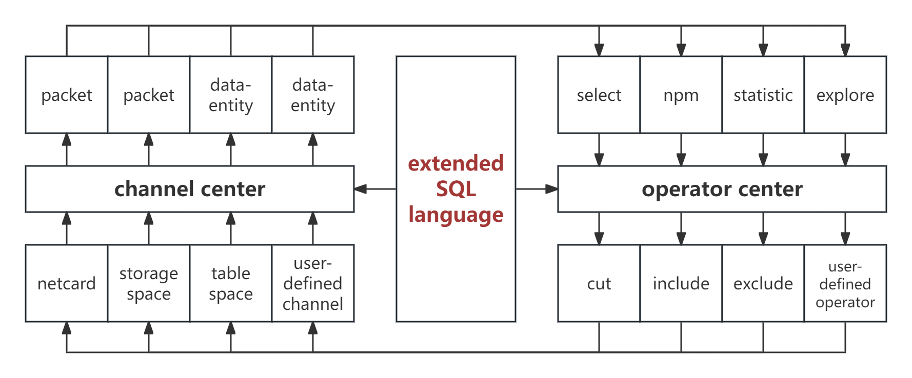
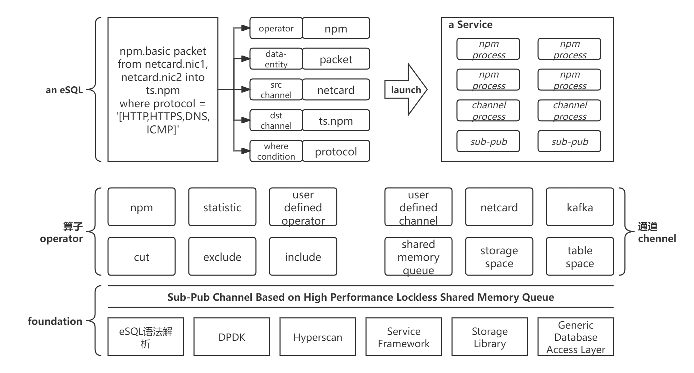

# 从网络流量采集到分析到数据探索，全栈式SQL语句搞定

## 背景

DPDK和Hyperscan广泛使用之后，网络流量采集与分析已经没有技术门槛，所有的NPM解决方案无一例外的采用DPDK进行网络流量的高速采集，并且基于Hyperscan技术进行高性能的特征匹配与提取。众多解决方案的差异只在于网络流量指标的多寡、分析精度的高低和数据的存储形式以及由此决定的“用数体验”。
各个NPM厂商宣传的100Gbps流量实时分析、海量数据存储以及PB级数据秒级查询等文案让广大受众误以为网络流量分析技术存在很高的门槛，无形中给用户和网络之间设置了壁垒。但是，真实的情况是——会SQL语句就能构建网络流量分析系统。

## 基于SQL语法的网络流量分析共创平台

### 平台简述

基于SQL语法的网络流量分析共创平台，全栈采用SQL语法，提供以下能力：
1. 数据采集
> select *packet* from *netcard.nic1, netcard.nic2* into *ss.packets*  <br>
> :采集网卡nic1和nic2的流量，将数据包存储在*ss.packets*磁盘存储空间。
2. NPM
> npm.basic packet from *netcard.nic1, netcard.nic2* into *ts.npm*  <br>
> :采集网卡nic1和nic2的流量，实时NPM分析 <br>
> npm.basic packet from *ss.packets* into *ts.npm*  <br>
> :回放*ss.packets*磁盘存储空间的数据包，事后NPM分析
3. 数据查询
> select packet from *ss.packets*  <br>
> select * from *ts.npm.tcp_session* where ip = '8.8.8.8'  <br>
4. 描述性统计分析
> statistic.hist bps from *ts.npm.tcp_session* where time = '[2024/07/14 00:00:00 - 2024/07/14 23:59:59]' group by application granularity 60 <br>
5. 探索性分析
> explore.pca bps,rss,connect_suc_rate from *ts.npm.tcp_session* where time = '[2024/07/14 00:00:00 - 2024/07/14 23:59:59]' group by application granularity 60  <br>
> explore.naivebayes bps,rss,connect_suc_rate from *ts.npm.tcp_session* where time = '[2024/07/14 00:00:00 - 2024/07/14 23:59:59]' group by application granularity 60  <br>
6. 模型助手
> 提供数据预处理和训练助手，基于神经网络的小模型进行数据模型探索。  <br>

基于上述能力，用户无需关注底层技术，只需要以关切的数据作为对象，就可以构建自己的流量分析平台。<br>

### 类SQL语法扩展
以通道和算子的概念补充SQL语句能力，同时补充了触发器和时间聚合粒度关键字。
|关键字|描述|
|-----|-----|
|各通道|如：netcard、kafka、ss、ts、smq|
|各算子|如：npm、statistic、explore、model|
|granularity|数据聚合粒度，时间单位为秒。与 GROUP BY 配合使用时，自动引入时间维度的分组，即 `GROUP BY field GRANULARITY 60` 等价于按 field 和60秒时间窗口联合分组|
|into|指定数据输出的目标通道，始终作为语句的最后一个子句|
|label|模型训练时指定标签字段|
|with|指定算子或模型的附加参数|

**标准子句顺序**：`算子 字段 FROM 通道 WHERE 条件 GROUP BY 分组 GRANULARITY 粒度 HAVING 聚合过滤 ORDER BY 排序 LIMIT 限制 INTO 目标`

**时间范围格式**：`'[起始时间 - 结束时间]'`，格式统一为 `yyyy/MM/dd HH:mm:ss`
- 闭合范围：`'[2024/07/14 00:00:00 - 2024/07/14 23:59:59]'`
- 开放结束（持续采集）：`'[2024/07/14 00:00:00 - ]'`
- 开放起始（历史至某时刻）：`'[ - 2024/07/14 23:59:59]'`

### 数据标准
平台提供的基本的NPM能力，各种指标均有标准化的定义，以便于统一使用。 <br>
平台提供数据字典注册机制，用户扩展算子***operator***提供的数据可以采用此机制进行标准化。<br>
平台提供数据处理标准化机制，用户可以扩展自定义数据通道***channel***。<br>

## 平台架构
### 逻辑架构图


### 实体描述
#### 通道channel
数据的源和目的称之为通道，网卡、kafka队列、存储空间（如磁盘目录）、数据库表空间、内存队列都是通道。
|通道|关键字|数据实体|描述|
|----|-----|-------|----|
|网卡|netcard|packet 数据包|> from netcard.nic1 从网卡采集数据包<br> > into netcard.nic1 向网卡写数据包<br> |
|kafka队列|kafka|profile定义|> insert into channel(type,name,profile) values('kafka','q1','......') <br> > from kafka.*q1* 从kafka队列*q1*读取数据<br> > into kafka.*q1* 向kafka队列*q1*写数据<br>|
|存储空间|ss|数据包 <br> profile定义|> insert into channel(type,name,profile) values('ss','packets','{path:disk./data}') <br> > into ss.packets 数据写入磁盘的/data目录，并将其命名为ss.packets，表示ss(storage space存储空间)的packets实体 <br> > from ss.packets 表示从存储空间的packets实体读取数据包|
|数据库表空间|ts|表/字段|> insert into channel(type,name,profile) values('ts','npm','......') <br> > into ts.npm 将数据写入ts(表空间).npm表空间 <br> > from ts.npm.tcp_session 从ts.npm表空间读取tcp_session表的内容|
|内存队列|smq|profile定义|> insert into channel(type,name,profile) values('smq','transactions','......') <br> > into smq.transactions  将数据写入transactions共享内存队列 <br> > from smq.transactions 从共享内存队列中读取数据|

#### 算子operator
在基础的SQL语句之上，平台以算子的形式扩展新的能力。算子为两级结构：算子归类（算类）和算子。select可以理解为平台默认提供的数据查询算子。根据算子的作用点，分为**数据分析算子**和**存储策略算子**。
|作用点|算类|算子|
|------|-----|-----|
|存储策略|cut|> cut.packet 64 数据包裁剪至64字节存储 <br> > cut.payload 128 数据包L4层负载裁剪至128字节存储|
|存储策略|exclude|> exclude.encrypted 加密协议数据包不存储 <br> > exclude.protocol ['HTTPS','POP3_SSL'] 指定协议不存储|
|存储策略|include|> include.protocol ['HTTP','DNS'] 指定协议存储 <br> > include.address ['macaddress':'00-15-5D-B1-37-24', 'ipaddress':'10.0.0.1/16', 'port':'8088'] 指定地址(mac、ip和端口)存储|
|数据分析|npm:NPM算类|basic:平台提供的基本网络流量分析算子|
|数据分析|statistic:描述性统计分析|basic:基本统计量分析 <br> hist:数据分布分析算子 <br> correlation:相关系数|
|数据分析|explore:数据探索分析|pca:主成分分析 <br> anova:方差分析 <br> chisquare:卡方分析 <br> regression:回归分析 <br> logit:逻辑回归分析 <br> decisiontree:决策树分析|
|数据分析|model:基于模型的数据探索|cnn:卷积神经网络 <br> lstm:长短期记忆网络 <br> autoencoder:自编码器 <br> isolation_forest:孤立森林 <br> kmeans:K均值聚类 <br> random_forest:随机森林 <br> xgboost:XGBoost|

> **explore 与 model 的区别**：explore 算子用于一次性的数据探索分析，直接输出分析结果，无需持久化模型；model 算子用于需要训练-持久化-推理的机器学习场景，支持模型的注册、版本管理和反复推理。

用户可以扩展算类和算子，平台提供算类、算子的注册和注销机制，并提供算子的运行服务框架。<br>
注册算子SQL语句示例：<br>
insert into operator(position,catelog,name,operatorfile,active) values('storage','exclude','encrypted','***operatorfile***',true) <br>
insert into operator(position,catelog,name,operatorfile,active) values('data','explore','chisquare','***operatorfile***',true) <br>
注销算子SQL语句示例：<br>
update operator set active=false where position='storage' and catelog='data' and name='chisquare' <br>

#### 数据实体data-entity
在定义通道的profile中描述（定义）其所承载的数据实体，通道承载数据实体，算子消费数据实体。
|通道|数据实体|算子|
|----|-------|----|
|netcard|packet|> npm.basic packet from netcard.nic1|
|ss|packet|> npm.basic packet from ss.packets|
|ts|数据表/字段|> select * from ts.npm.tcp_session <br> > explore.hist bps,rss from ts.npm.tcp_session group by protocol|

#### 运行框架framework


#### 自定义算子
##### 高性能算子
高性能算子采用C++语言编写，接口伪代码定义如下：
```C++
#include <string>
#include <vector>
interface IOperator {
  virtual ~IOperator() = default;
  virtual std::string Catelog() = 0;
  virtual std::string Name() = 0;
  virtual std::string Description() = 0;
  virtual int Work(std::vector<IChannel*> in, IChannel* out) = 0;
};
```

##### 数据探索算子
数据探索算子采用python语言编写，用户可实时编写python代码对数据进行探索性分析，并将有价值的探索固化为算子注入平台。
数据探索算子处理的数据实体类型为pandas.DataFrame，返回值也是pandas.DataFrame
1. 探索
```Python
import numpy as np
import pandas as pd
from dasci import eSql

def Chisquare(dfdata: pandas.DataFrame):
    from scipy.stats import chi2_contingency

    cross_table = pd.crosstab(dfdata.iloc[:,0].squeeze(), dfdata.iloc[:,1].squeeze(), margins=False)
    chi2, p_value, dof, expected = chi2_contingency(cross_table)
    result = '{' + f"'卡方值':{chi2},'P值':{p_value},'自由度':{dof},'期望频数':{expected}" + '}'
    print(result)
    return result

dfdata = eSql.excute("select f1, f2 from ts.npm.tcp_session granularity 60 where time = '[2024/07/14 00:00:00 - 2024/07/14 23:59:59]'")
Chisquare(dfdata)
```

2. 注入算子
```Python
import numpy as np
import pandas as pd
from dasci import operator

class ChisquareOperator:
  def __init__(self):
    self.Attribute = {
        "Catelog": "explore",
        "Name": "chisquare",
        "Description": "对两种分类型变量进行相关性分析"
    }

  def Catelog(self) -> str:
    return self.Attribute["Catelog"]

  def Name(self) -> str:
    return self.Attribute["Name"]

  def Description(self) -> str:
    return self.Attribute["Description"]

  def Work(self, dfdata: pandas.DataFrame) -> pandas.DataFrame:
    """
      dfdata -> pandas.DataFrame
      return -> pandas.DataFrame
    """
    from scipy.stats import chi2_contingency
    
    cross_table = pd.crosstab(dfdata.iloc[:,0].squeeze(), dfdata.iloc[:,1].squeeze(), margins=False)
    chi2, p_value, dof, expected = chi2_contingency(cross_table)
    result = pd.DataFrame({
      '卡方值': [chi2],
      'P值': [p_value],
      '自由度': [dof],
      '期望频数': [expected]
    })
    return result

# 将当前代码注入为算子
operator.Inject(ChisquareOperator)
```
3. 使用自定义算子
```Python
import numpy as np
import pandas as pd
from dasci import eSql

dfdata = eSql.excute("explore.chisquare f1, f2 from ts.npm.tcp_session granularity 60 where time = '[2024/07/14 00:00:00 - 2024/07/14 23:59:59]'")
print(dfdata)
```
#### 自定义通道与数据实体
##### 高性能通道
高性能通道采用C++语言编写，接口伪代码定义如下：
```C++
#include <string>
interface IChannel {
  virtual ~IChannel() = default;
  virtual std::string Catelog() = 0;
  virtual std::string Name() = 0;
  virtual std::string Description() = 0;
  virtual int Put(IDataEntity*) = 0;
  virtual IDataEntity* Get() = 0;
};
```

**数据实体定义**

数据实体采用标准化接口定义，提供统一的数据访问和操作能力：

```C++
#include <string>
#include <vector>
#include <map>
#include <memory>
#include <variant>
#include <cstdint>

// 数据类型枚举
enum class DataType {
  INT32,
  INT64,
  UINT32,
  UINT64,
  FLOAT,
  DOUBLE,
  STRING,
  BYTES,
  TIMESTAMP,
  BOOLEAN
};

// 字段值类型（类型安全的值容器）
using FieldValue = std::variant<
  int32_t, int64_t, uint32_t, uint64_t,
  float, double,
  std::string, std::vector<uint8_t>,
  bool
>;

// 字段定义
struct Field {
  std::string name;
  DataType type;
  size_t size;  // 对于 BYTES 和 STRING 类型
  std::string description;
};

// 数据实体接口
interface IDataEntity {
  virtual ~IDataEntity() = default;

  // 获取实体类型名称（如 "packet", "tcp_session", "http_transaction"）
  virtual std::string GetEntityType() = 0;

  // 获取实体的字段定义
  virtual std::vector<Field> GetSchema() = 0;

  // 获取字段值（类型安全）
  virtual FieldValue GetFieldValue(const std::string& fieldName) = 0;

  // 设置字段值（类型安全）
  virtual bool SetFieldValue(const std::string& fieldName, const FieldValue& value) = 0;

  // 序列化为字节流（用于网络传输或存储）
  virtual std::vector<uint8_t> Serialize() = 0;

  // 从字节流反序列化
  virtual bool Deserialize(const std::vector<uint8_t>& data) = 0;

  // 转换为 JSON 格式（用于调试和数据交换）
  virtual std::string ToJson() = 0;

  // 克隆实体
  virtual std::shared_ptr<IDataEntity> Clone() = 0;
};

// 数据包实体示例
class PacketEntity : public IDataEntity {
private:
  uint64_t timestamp;
  std::vector<uint8_t> raw_data;
  std::string src_mac;
  std::string dst_mac;
  std::string src_ip;
  std::string dst_ip;
  uint16_t src_port;
  uint16_t dst_port;
  std::string protocol;

public:
  std::string GetEntityType() override { return "packet"; }

  std::vector<Field> GetSchema() override {
    return {
      {"timestamp", DataType::UINT64, 8, "数据包时间戳"},
      {"raw_data", DataType::BYTES, 0, "原始数据包内容"},
      {"src_mac", DataType::STRING, 0, "源MAC地址"},
      {"dst_mac", DataType::STRING, 0, "目标MAC地址"},
      {"src_ip", DataType::STRING, 0, "源IP地址"},
      {"dst_ip", DataType::STRING, 0, "目标IP地址"},
      {"src_port", DataType::UINT32, 2, "源端口"},
      {"dst_port", DataType::UINT32, 2, "目标端口"},
      {"protocol", DataType::STRING, 0, "协议类型"}
    };
  }

  // 实现其他接口方法...
};
```

**数据实体注册机制**：

数据实体通过 `data_entity` 表统一注册，通道在 profile 中通过实体名称引用已注册的数据实体定义。
```sql
-- 注册数据实体定义
INSERT INTO data_entity(name, schema, description)
VALUES('packet', '{"fields":[...]}', '网络数据包实体');

-- 查询已注册的数据实体
SELECT * FROM data_entity WHERE name = 'packet';

-- 通道 profile 中引用数据实体
INSERT INTO channel(type, name, profile)
VALUES('kafka', 'q1', '{"entity": "packet", "bootstrap_servers": "..."}');
```

##### 数据探索通道
数据探索通道采用python语言编写，用户可实时编写python代码对数据进行探索性分析，并将有价值的探索固化为通道注入平台。<br>
数据探索通道的数据实体类型都是pandas.DataFrame
```Python
import numpy as np
import pandas as pd
from dasci import channel

class MyChannel:
  def __init__(self):
    self.Attribute = {
      "Catelog": "MyCatelog",
      "Name": "MyName",
      "Description": "MyDescription"
    }

  def Catelog(self) -> str:
    return self.Attribute["Catelog"]

  def Name(self) -> str:
    return self.Attribute["Name"]

  def Description(self) -> str:
    return self.Attribute["Description"]

  def Put(self, data: pandas.Dataframe):
    # Write data to mychannel

  def Get(self) -> pandas.Dataframe:
    # Read data from mychannel
    return pandas.Dataframe

# 将当前代码注入为通道
channel.Inject(MyChannel)
```

## 平台能力描述
### 数据采集
#### 网卡采集数据包
##### 全量采集
> select *packet* from *netcard.nic1, netcard.nic2* where time = '[2024/07/14 00:00:00 - ]' into *ss.packets*  <br>
> : 从2024/07/14 00:00:00开始采集nic1和nic2网卡的流量，将数据包存储ss.packets存储空间，后续对这些数据包的访问使用ss.packets对象即可。
##### 过滤采集
|过滤类型|关键字|语句示例|
|-------|------|-------|
|物理地址|macaddress|> select *packet* from *netcard.nic1* where macaddress = '00-15-5D-B1-37-24' into *ss.packets*  <br>> select *packet* from *netcard.nic1* where macaddress1 = '00-15-5D-B1-37-24' and macaddress2 = 'B0-3C-DC-D8-A6-98' into *ss.packets*  <br>|
|IP地址|ipaddress|> select *packet* from *netcard.nic1* where ipaddress = '8.8.8.8' into *ss.packets*  <br> > select *packet* from *netcard.nic1* where ipaddress1 = '114.114.114.114' and ipaddress2 = '192.168.1.9' into *ss.packets*  <br> > select *packet* from *netcard.nic1* where ipaddress = '[8.8.8.1-8.8.8.10]' into *ss.packets*  <br>  > select *packet* from *netcard.nic1* where ipaddress = '192.168.1.1/16' into *ss.packets*  <br> |
|端口|port|> select *packet* from *netcard.nic1* where port = '33330' into *ss.packets*  <br> > select *packet* from *netcard.nic1* where port1 = '1234' and port2 = '5678' into *ss.packets*  <br> > select *packet* from *netcard.nic1* where port = '[7890-7899]' into *ss.packets*  <br> |
|协议|protocol|> select *packet* from *netcard.nic1* where protocol = 'TCP' into *ss.packets*  <br> > select *packet* from *netcard.nic1* where protocol = '[HTTP,HTTPS,DNS,ICMP]' into *ss.packets*  <br> |
|应用|application|> select *packet* from *netcard.nic1* where application = 'QQMail' into *ss.packets*  <br> > select *packet* from *netcard.nic1* where application = '[QQMail,Gmail]' into *ss.packets*  <br> |

#### kafka采集数据

Kafka 通道用于从 Kafka 队列中读取数据或向 Kafka 队列写入数据。

##### Kafka 通道配置

```sql
-- 创建 Kafka 通道
INSERT INTO channel(type, name, profile)
VALUES('kafka', 'traffic_queue', '{
  "bootstrap_servers": "192.168.1.100:9092,192.168.1.101:9092",
  "topic": "network_traffic",
  "group_id": "npm_consumer_group",
  "auto_offset_reset": "earliest",
  "enable_auto_commit": true,
  "max_poll_records": 1000,
  "security_protocol": "PLAINTEXT",
  "data_format": "json"
}');
```

##### 从 Kafka 采集数据

```sql
-- 从 Kafka 队列读取数据包并进行 NPM 分析
npm.basic packet FROM kafka.traffic_queue
WHERE time = '[2024/07/14 00:00:00 - ]'
INTO ts.npm;

-- 从 Kafka 读取数据包并存储到磁盘
SELECT packet FROM kafka.traffic_queue
WHERE time = '[2024/07/14 00:00:00 - 2024/07/14 23:59:59]'
INTO ss.packets;

-- 从 Kafka 读取特定协议的数据
SELECT packet FROM kafka.traffic_queue
WHERE protocol = 'HTTP'
INTO ss.http_packets;
```

##### 向 Kafka 写入数据

```sql
-- 将网卡采集的数据包写入 Kafka
SELECT packet FROM netcard.nic1
WHERE time = '[2024/07/14 00:00:00 - ]'
INTO kafka.traffic_queue;

-- 将分析结果写入 Kafka
SELECT * FROM ts.npm.tcp_session
WHERE time = '[2024/07/14 00:00:00 - 2024/07/14 23:59:59]'
INTO kafka.analysis_results;
```

##### Kafka 通道特性

- 支持多个 broker 的高可用配置
- 支持消费者组，实现负载均衡
- 支持数据格式：JSON、Avro、Protobuf
- 支持安全协议：PLAINTEXT、SSL、SASL_PLAINTEXT、SASL_SSL
- 自动处理偏移量管理
- 支持批量读写以提高性能

### NPM
#### 数据包存储
##### 完整存储
支持将采集的数据包进行全量存储。
##### 存储策略
内置多种存储策略，支持扩展策略算子。
|策略|关键字|语句示例|
|----|-----|--------|
|所有的采集过滤类型|-|-|
|裁剪策略|**cut**|> **cut.packet** 64 数据包裁剪至64字节存储 <br> > **cut.payload** 128 数据包L4层负载裁剪至128字节存储|
|排除策略|**exclude**|> **exclude.encrypted** 加密协议数据包不存储 <br> > **exclude.protocol** ['HTTPS','POP3_SSL'] 指定协议不存储|
|包含策略|**include**|> **include.protocol** ['HTTP','DNS'] 指定协议存储 <br> > **include.address** ['macaddress':'00-15-5D-B1-37-24', 'ipaddress':'10.0.0.1/16', 'port':'8088'] 指定地址(mac、ip和端口)存储|

#### 协议识别
内置基于特征的高性能协议识别引擎，支持用户扩展特征。

#### 应用识别
内置高性能应用定义与识别引擎，支持用户自定义应用。
|定义对象|示例|
|-------|-----|
|会话五元组|> [IP]:[TCP/UDP]:[PORT]->[IP]:[TCP/UDP]:PORT <br> |
|协议+IP|> [DNS/HTTP]:[IP]|
|Host+URL|> [Host:www.baidu.com]:[URL:/news]|

#### 会话统计分析

NPM 的会话统计分析提供对 TCP/UDP 会话的全面统计能力。

> **UDP 会话定义**：UDP 为无连接协议，平台以五元组（src_ip, dst_ip, src_port, dst_port, protocol）标识一个 UDP 会话，当同一五元组在配置的超时时间（默认30秒）内无新数据包时，视为会话结束。UDP 会话的统计指标与 TCP 会话共享 packets_sent/recv、bytes_sent/recv 等通用字段，但不包含 TCP 特有的 retrans、rtt、connect_time、close_time 等指标。

##### TCP 会话统计指标

```sql
-- TCP 会话基本统计
SELECT
  session_id,              -- 会话ID
  src_ip, dst_ip,          -- 源/目标IP
  src_port, dst_port,      -- 源/目标端口
  protocol,                -- 协议
  application,             -- 应用
  start_time,              -- 会话开始时间
  end_time,                -- 会话结束时间
  duration,                -- 会话持续时间（秒）
  packets_sent,            -- 发送数据包数
  packets_recv,            -- 接收数据包数
  bytes_sent,              -- 发送字节数
  bytes_recv,              -- 接收字节数
  retrans_packets,         -- 重传数据包数
  retrans_rate,            -- 重传率
  rtt_avg,                 -- 平均往返时间（ms）
  rtt_min,                 -- 最小往返时间
  rtt_max,                 -- 最大往返时间
  connect_time,            -- 连接建立时间（三次握手）
  close_time,              -- 连接关闭时间（四次挥手）
  connection_status        -- 连接状态（正常/异常）
FROM ts.npm.tcp_session
WHERE time = '[2024/07/14 00:00:00 - 2024/07/14 23:59:59]';
```

##### 会话聚合统计

```sql
-- 按应用聚合统计
SELECT
  application,
  COUNT(*) as session_count,
  SUM(bytes_sent + bytes_recv) as total_bytes,
  AVG(duration) as avg_duration,
  AVG(rtt_avg) as avg_rtt,
  SUM(retrans_packets) as total_retrans
FROM ts.npm.tcp_session
WHERE time = '[2024/07/14 00:00:00 - 2024/07/14 23:59:59]'
GROUP BY application
GRANULARITY 300;  -- 5分钟粒度

-- 按时间段统计会话数和流量
SELECT
  time_bucket,
  COUNT(*) as session_count,
  SUM(bytes_sent + bytes_recv) / 1024 / 1024 as traffic_mb,
  AVG(rtt_avg) as avg_rtt
FROM ts.npm.tcp_session
WHERE time = '[2024/07/14 00:00:00 - 2024/07/14 23:59:59]'
GROUP BY time
GRANULARITY 60;  -- 1分钟粒度
```

##### 会话质量分析

```sql
-- 识别异常会话
SELECT
  session_id, src_ip, dst_ip, application,
  retrans_rate, rtt_avg, duration
FROM ts.npm.tcp_session
WHERE time = '[2024/07/14 00:00:00 - 2024/07/14 23:59:59]'
  AND (retrans_rate > 0.05 OR rtt_avg > 200 OR connection_status = 'abnormal')
ORDER BY retrans_rate DESC;

-- Top N 流量会话
SELECT
  session_id, src_ip, dst_ip, application,
  (bytes_sent + bytes_recv) / 1024 / 1024 as traffic_mb
FROM ts.npm.tcp_session
WHERE time = '[2024/07/14 00:00:00 - 2024/07/14 23:59:59]'
ORDER BY traffic_mb DESC
LIMIT 100;
```

#### ICMP分析

ICMP 协议分析用于网络诊断和故障排查。

##### ICMP 消息类型统计

```sql
-- ICMP 消息类型分布
SELECT
  icmp_type,               -- ICMP 类型（0=Echo Reply, 8=Echo Request等）
  icmp_code,               -- ICMP 代码
  COUNT(*) as count,
  src_ip, dst_ip
FROM ts.npm.icmp_messages
WHERE time = '[2024/07/14 00:00:00 - 2024/07/14 23:59:59]'
GROUP BY icmp_type, icmp_code, src_ip, dst_ip
GRANULARITY 60;
```

##### Ping 分析

```sql
-- Ping 往返时间分析
SELECT
  src_ip, dst_ip,
  sequence_number,
  rtt,                     -- 往返时间（ms）
  ttl,                     -- 生存时间
  packet_size,             -- 数据包大小
  timestamp
FROM ts.npm.icmp_ping
WHERE time = '[2024/07/14 00:00:00 - 2024/07/14 23:59:59]'
  AND icmp_type = 8        -- Echo Request
ORDER BY timestamp;

-- Ping 统计摘要
SELECT
  src_ip, dst_ip,
  COUNT(*) as packets_sent,
  SUM(CASE WHEN reply_received THEN 1 ELSE 0 END) as packets_recv,
  (1 - SUM(CASE WHEN reply_received THEN 1 ELSE 0 END) / COUNT(*)) * 100 as loss_rate,
  AVG(rtt) as avg_rtt,
  MIN(rtt) as min_rtt,
  MAX(rtt) as max_rtt
FROM ts.npm.icmp_ping
WHERE time = '[2024/07/14 00:00:00 - 2024/07/14 23:59:59]'
GROUP BY src_ip, dst_ip;
```

##### ICMP 异常检测

```sql
-- 检测 ICMP 洪泛攻击
SELECT
  src_ip,
  COUNT(*) as icmp_count,
  COUNT(DISTINCT dst_ip) as target_count
FROM ts.npm.icmp_messages
WHERE time = '[2024/07/14 00:00:00 - 2024/07/14 23:59:59]'
GROUP BY src_ip
GRANULARITY 10
HAVING icmp_count > 1000;  -- 10秒内超过1000个ICMP包

-- 检测目标不可达消息
SELECT
  dst_ip,
  icmp_code,               -- 0=网络不可达, 1=主机不可达, 3=端口不可达
  COUNT(*) as count
FROM ts.npm.icmp_messages
WHERE time = '[2024/07/14 00:00:00 - 2024/07/14 23:59:59]'
  AND icmp_type = 3        -- Destination Unreachable
GROUP BY dst_ip, icmp_code;
```

#### HTTP分析

HTTP 协议分析提供 Web 流量的深度洞察。

##### HTTP 事务分析

```sql
-- HTTP 事务详情
SELECT
  transaction_id,
  src_ip, dst_ip,
  method,                  -- GET, POST, PUT, DELETE等
  host,                    -- Host头
  url,                     -- 请求URL
  user_agent,              -- User-Agent
  referer,                 -- Referer
  status_code,             -- HTTP状态码
  content_type,            -- Content-Type
  request_size,            -- 请求大小（字节）
  response_size,           -- 响应大小（字节）
  response_time,           -- 响应时间（ms）
  timestamp
FROM ts.npm.http_transactions
WHERE time = '[2024/07/14 00:00:00 - 2024/07/14 23:59:59]';
```

##### HTTP 性能分析

```sql
-- 慢请求分析
SELECT
  host, url, method,
  AVG(response_time) as avg_response_time,
  MAX(response_time) as max_response_time,
  COUNT(*) as request_count
FROM ts.npm.http_transactions
WHERE time = '[2024/07/14 00:00:00 - 2024/07/14 23:59:59]'
GROUP BY host, url, method
HAVING avg_response_time > 1000  -- 平均响应时间超过1秒
ORDER BY avg_response_time DESC;

-- HTTP 状态码分布
SELECT
  status_code,
  COUNT(*) as count,
  COUNT(*) * 100.0 / SUM(COUNT(*)) OVER() as percentage
FROM ts.npm.http_transactions
WHERE time = '[2024/07/14 00:00:00 - 2024/07/14 23:59:59]'
GROUP BY status_code
ORDER BY count DESC;
```

##### HTTP 流量分析

```sql
-- Top 访问的 URL
SELECT
  host, url,
  COUNT(*) as visit_count,
  SUM(request_size + response_size) / 1024 / 1024 as traffic_mb
FROM ts.npm.http_transactions
WHERE time = '[2024/07/14 00:00:00 - 2024/07/14 23:59:59]'
GROUP BY host, url
ORDER BY visit_count DESC
LIMIT 100;

-- User-Agent 分布
SELECT
  user_agent,
  COUNT(*) as count
FROM ts.npm.http_transactions
WHERE time = '[2024/07/14 00:00:00 - 2024/07/14 23:59:59]'
GROUP BY user_agent
ORDER BY count DESC;
```

##### HTTP 安全分析

```sql
-- 检测可疑的 HTTP 请求
SELECT
  src_ip, dst_ip, host, url, method,
  user_agent, status_code
FROM ts.npm.http_transactions
WHERE time = '[2024/07/14 00:00:00 - 2024/07/14 23:59:59]'
  AND (
    url LIKE '%<script%'           -- XSS攻击特征
    OR url LIKE '%union%select%'   -- SQL注入特征
    OR url LIKE '%../../../%'      -- 路径遍历特征
    OR status_code = 401           -- 未授权访问
    OR status_code = 403           -- 禁止访问
  );
```

#### TLS分析

TLS 握手分析用于加密流量的可见性和安全审计。

##### TLS 握手信息

```sql
-- TLS 握手详情
SELECT
  session_id,
  src_ip, dst_ip,
  tls_version,             -- TLS版本（TLS1.0/1.1/1.2/1.3）
  cipher_suite,            -- 密码套件
  sni,                     -- Server Name Indication
  ja3_fingerprint,         -- JA3客户端指纹
  ja3s_fingerprint,        -- JA3S服务端指纹
  certificate_subject,     -- 证书主题
  certificate_issuer,      -- 证书颁发者
  certificate_not_before,  -- 证书生效时间
  certificate_not_after,   -- 证书过期时间
  handshake_time,          -- 握手耗时（ms）
  timestamp
FROM ts.npm.tls_handshakes
WHERE time = '[2024/07/14 00:00:00 - 2024/07/14 23:59:59]';
```

##### TLS 安全分析

```sql
-- 检测过期或即将过期的证书
SELECT
  dst_ip, sni, certificate_subject,
  certificate_not_after,
  certificate_issuer
FROM ts.npm.tls_handshakes
WHERE time = '[2024/07/14 00:00:00 - 2024/07/14 23:59:59]'
  AND certificate_not_after < '2024/08/14 00:00:00';

-- 检测弱TLS版本
SELECT
  src_ip, dst_ip, sni, tls_version,
  COUNT(*) as count
FROM ts.npm.tls_handshakes
WHERE time = '[2024/07/14 00:00:00 - 2024/07/14 23:59:59]'
  AND tls_version IN ('TLS1.0', 'TLS1.1')
GROUP BY src_ip, dst_ip, sni, tls_version;
```

#### DNS分析

DNS 协议分析用于域名解析监控和安全检测。

##### DNS 查询分析

```sql
-- DNS 查询详情
SELECT
  query_id,
  src_ip, dst_ip,
  query_name,              -- 查询的域名
  query_type,              -- A, AAAA, MX, CNAME, TXT等
  response_code,           -- 0=成功, 3=域名不存在等
  answer_count,            -- 应答记录数
  answer_records,          -- 应答记录列表
  query_time,              -- 查询时间
  response_time,           -- 响应时间（ms）
  timestamp
FROM ts.npm.dns_queries
WHERE time = '[2024/07/14 00:00:00 - 2024/07/14 23:59:59]';
```

##### DNS 统计分析

```sql
-- Top 查询域名
SELECT
  query_name,
  COUNT(*) as query_count,
  AVG(response_time) as avg_response_time
FROM ts.npm.dns_queries
WHERE time = '[2024/07/14 00:00:00 - 2024/07/14 23:59:59]'
GROUP BY query_name
ORDER BY query_count DESC
LIMIT 100;

-- DNS 查询类型分布
SELECT
  query_type,
  COUNT(*) as count
FROM ts.npm.dns_queries
WHERE time = '[2024/07/14 00:00:00 - 2024/07/14 23:59:59]'
GROUP BY query_type;

-- DNS 响应码分布
SELECT
  response_code,
  COUNT(*) as count
FROM ts.npm.dns_queries
WHERE time = '[2024/07/14 00:00:00 - 2024/07/14 23:59:59]'
GROUP BY response_code;
```

##### DNS 安全分析

```sql
-- 检测 DNS 隧道（异常长的域名查询）
SELECT
  src_ip, query_name,
  LENGTH(query_name) as name_length,
  COUNT(*) as query_count
FROM ts.npm.dns_queries
WHERE time = '[2024/07/14 00:00:00 - 2024/07/14 23:59:59]'
  AND LENGTH(query_name) > 100  -- 域名长度超过100字符
GROUP BY src_ip, query_name
ORDER BY name_length DESC;

-- 检测 DGA（域名生成算法）特征
SELECT
  src_ip, query_name,
  response_code
FROM ts.npm.dns_queries
WHERE time = '[2024/07/14 00:00:00 - 2024/07/14 23:59:59]'
  AND response_code = 3          -- NXDOMAIN
  AND query_name REGEXP '[a-z]{20,}';  -- 长随机字符串

-- 检测 DNS 放大攻击
SELECT
  src_ip,
  COUNT(*) as query_count,
  COUNT(DISTINCT query_name) as unique_domains
FROM ts.npm.dns_queries
WHERE time = '[2024/07/14 00:00:00 - 2024/07/14 23:59:59]'
  AND query_type = 'ANY'         -- ANY类型查询
GROUP BY src_ip
GRANULARITY 10
HAVING query_count > 100;        -- 10秒内超过100次查询
```

### 数据查询
#### 数据包查询
支持选定时间范围，以物理地址、IP地址、端口、协议、应用作为条件查询数据包，语法与过滤采集相同。<br>
select packet from ss.packets where time = '[2024/07/14 00:00:00 - 2024/07/14 01:59:59]' and protocol = 'HTTP' into ***channel*** <br>
***channel***是查询的数据包投送的通道。

#### 数据查询

### 描述性统计分析
#### statistic.basic 基本统计指标
#### statistic.hist 数据分布统计

### 探索性分析
#### explore.pca 主成分分析
#### explore.anova 方差分析
#### explore.chisquare 卡方分析

### 基于模型的数据探索

模型算子提供基于机器学习和深度学习的数据探索能力，用于流量分类、异常检测、模式识别等高级分析场景。

#### 模型算子分类

| 算子名称 | 功能描述 | 应用场景 |
|---------|---------|---------|
| model.cnn | 卷积神经网络 | 加密流量分类、协议识别 |
| model.lstm | 长短期记忆网络 | 时序流量预测、异常检测 |
| model.autoencoder | 自编码器 | 异常流量检测、特征降维 |
| model.isolation_forest | 孤立森林 | 异常检测 |
| model.kmeans | K均值聚类 | 流量模式聚类 |
| model.random_forest | 随机森林 | 流量分类、特征重要性分析 |
| model.xgboost | XGBoost | 高性能分类和回归 |

#### 模型训练

```sql
-- 训练加密流量分类模型
model.train cnn
SELECT bytes_sent, bytes_recv, packets_sent, packets_recv, duration, rtt_avg
FROM ts.npm.tcp_session
WHERE time = '[2024/07/01 00:00:00 - 2024/07/14 23:59:59]'
  AND protocol = 'TLS'
LABEL application
INTO model.encrypted_traffic_classifier
WITH parameters = '{
  "epochs": 50,
  "batch_size": 128,
  "learning_rate": 0.001,
  "validation_split": 0.2
}';

-- 训练异常检测模型
model.train autoencoder
SELECT bps, pps, retrans_rate, rtt_avg
FROM ts.npm.tcp_session
WHERE time = '[2024/07/01 00:00:00 - 2024/07/14 23:59:59]'
GRANULARITY 60
INTO model.anomaly_detector
WITH parameters = '{
  "encoding_dim": 16,
  "epochs": 100,
  "threshold": 0.95
}';
```

#### 模型推理

```sql
-- 使用模型进行加密流量分类
model.predict encrypted_traffic_classifier
FROM ts.npm.tcp_session
WHERE time = '[2024/07/15 00:00:00 - 2024/07/15 23:59:59]'
  AND protocol = 'TLS'
INTO ts.npm.encrypted_traffic_predictions;

-- 使用模型检测异常流量
model.predict anomaly_detector
FROM ts.npm.tcp_session
WHERE time = '[2024/07/15 00:00:00 - 2024/07/15 23:59:59]'
GRANULARITY 60
HAVING anomaly_score > 0.8  -- 只保留异常分数高的记录
INTO ts.npm.anomaly_scores;
```

#### 模型评估

```sql
-- 评估模型性能
model.evaluate encrypted_traffic_classifier
FROM ts.npm.tcp_session
WHERE time = '[2024/07/15 00:00:00 - 2024/07/15 23:59:59]'
LABEL application
METRICS = ['accuracy', 'precision', 'recall', 'f1_score'];

-- 查看模型信息
SELECT
  model_name,
  model_type,
  training_date,
  accuracy,
  parameters
FROM model.registry
WHERE model_name = 'encrypted_traffic_classifier';
```

#### 模型管理

```sql
-- 注册模型
INSERT INTO model.registry(name, type, file_path, description, parameters)
VALUES('encrypted_traffic_classifier', 'cnn', '/models/etc_v1.h5',
       '加密流量分类器', '{"epochs":50,"batch_size":128}');

-- 更新模型
UPDATE model.registry
SET file_path = '/models/etc_v2.h5', version = 2
WHERE name = 'encrypted_traffic_classifier';

-- 删除模型
DELETE FROM model.registry
WHERE name = 'encrypted_traffic_classifier';
```

### 任务生命周期管理

持续运行的采集和分析任务需要生命周期管理能力。

#### 任务控制语句

```sql
-- 查看当前运行的任务
SELECT * FROM sys.tasks WHERE status = 'running';

-- 停止任务
STOP TASK task_id;

-- 暂停任务（保留状态，可恢复）
PAUSE TASK task_id;

-- 恢复暂停的任务
RESUME TASK task_id;

-- 查看任务历史
SELECT * FROM sys.tasks
WHERE time = '[2024/07/14 00:00:00 - 2024/07/14 23:59:59]'
ORDER BY start_time DESC;
```

#### 任务状态

| 状态 | 描述 |
|------|------|
| running | 任务正在运行 |
| paused | 任务已暂停，可恢复 |
| stopped | 任务已停止 |
| failed | 任务执行失败 |
| completed | 任务已完成（有限时间范围的任务） |
