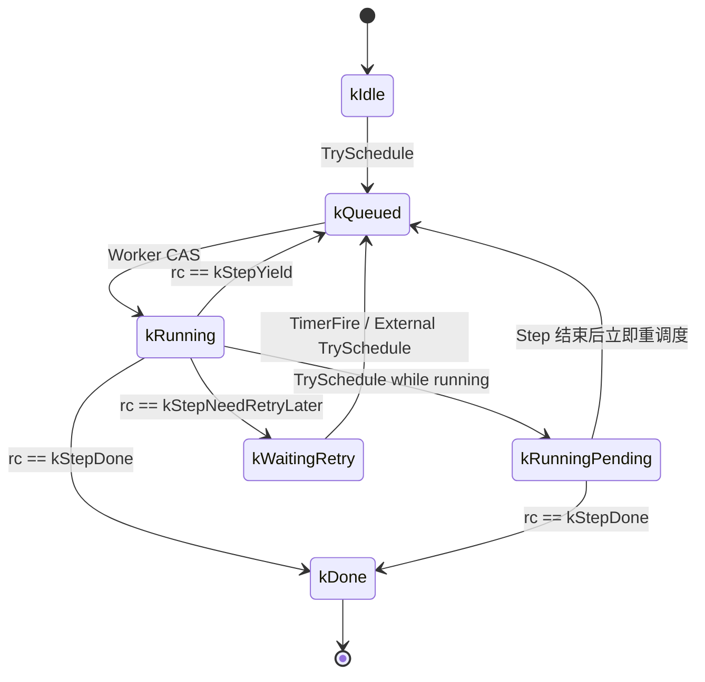

# Sprint 12 设计文档：流式处理基础设施（Epic 14，Story 14.0-14.4）

## 背景与目标

经过 11 个迭代，FlowSQL 建立了完整的批处理能力。本 Sprint 实现流式处理框架基础设施，
为实时数据处理（如网络性能分析）奠定接口和运行时基础。

本稿为 Sprint 12 流式框架的**替代版设计**：旧 `StreamTask v1 / RunnerLoop / Poll(int)` 方案不再保留，后续实现以本文档为唯一基线。

### 2026-04-02 设计修订（已确认）

针对 `INTO` 输出绑定，采用单轨方案：

1. 不引入 `V1/V2` 双轨，直接以当前接口演进为准。
2. Scheduler 不再隐式把流式算子输出统一为 `IStreamChannel`，而是按 `INTO` 绑定真实通道类型并传给算子。
3. `builtin.*` 保持内部默认 `IStreamChannel` 输出模型；遇到非 stream sink 时，在算子内部按需调用 `StreamChannelAdapter`。
4. 不再使用 `WITH sink_table` 作为框架层表名传递机制。
5. `builtin.*` 遇到两段式数据库目标（`INTO <db_type>.<db_name>`）直接报错，要求三段式显式表名。

---

## 流式架构的两条路径

流式数据处理存在两种本质不同的场景，需要分别设计：

### 路径A：结构化列式流（本 Sprint 实现）

**特征**：通道产生多列结构化数据（已解析、固定 schema）

**数据流**：
```
通道采集线程（解析后）
    ↓ Put(RecordBatch, ts_ms)
IStreamChannel（ring buffer，RecordBatch 传输）
    ↓ PollNext() -> PollEvent{Data/Timeout/Eof/DrainedAfterCancel/Error}
IStreamOperator::Process(RecordBatch)
    ↓ 算子内部聚合/过滤/转换
IDatabaseChannel（写出）
```

**适用场景**：
- SQL 流分析（Kafka → 聚合 → ClickHouse）
- 日志流处理（Fluentd 风格）
- IoT 传感器数据（已解析的 JSON/Protobuf）
- 网络流量统计（已解析的包头字段：5-tuple + 统计量）

**性能特点**：
- RecordBatch 列式存储，SIMD 友好，适合聚合分析
- 通道内完成解析，算子拿到的是结构化数据
- 单核可处理 10Gbps 解析后的包头字段（~20K 批次/秒）

---

### 路径B：块状原始流（后续 DPDK Sprint）

**特征**：通道产生原始字节块（未解析、变长、需要零拷贝）

**数据流**：
```
通道采集线程（DPDK）
    ↓ rte_mbuf（大页内存，零拷贝）
IBlockStreamChannel（通道与算子私有协议）
    ↓ 算子自驱动循环（不经过框架 Process 调用）
IBlockStreamOperator（DPI 算子，直接操作 mbuf）
    ↓ 处理完后 rte_mbuf_free()
IDatabaseChannel（写出提取后的结构化结果）
```

**适用场景**：
- DPI 深度包检测（需要完整 payload）
- 线速网络采集（10Gbps+ 零拷贝）
- 原始协议分析（自定义协议栈）

**性能特点**：
- DPDK rte_ring + rte_mempool，零拷贝
- 算子直接操作 mbuf，不经过 RecordBatch 转换
- 框架只负责 Start/Stop，不介入数据流

---

### 两条路径的接口隔离

**路径A**：`IStreamChannel` + `IStreamOperator`（本 Sprint 完整实现）

**路径B**：`IBlockStreamChannel` + `IBlockStreamOperator`（接口占位延后到下个迭代）

共享的扩展点只保留在**控制面**：`ChannelType` 路由、Scheduler 生命周期（execute/stop/status）、插件装载与任务可观测；数据面不做统一抽象，避免把 `RecordBatch` 语义强加到块状原始流。

Scheduler 通过 `channel->Type()` 识别：
- `Type() == "stream"` → 路径A（RecordBatch 流）
- `Type() == "block_stream"` → 路径B（块状流，后续实现）

**两条路径不强制统一**，避免为了统一而牺牲性能或引入不必要的复杂度。

---

## 架构决策汇总

| 决策点 | 结论 |
|--------|------|
| 数据单元 | Arrow RecordBatch 微批，带采集时间戳 `ts_ms` |
| 通道传输 | 进程内 ring buffer，C++17 无锁实现；DPDK rte_ring 后续可选接入 |
| Ring 并发模式 | 接口预留 SPSC/MPSC/SPMC/MPMC 四种模式；本 Sprint 落地 SPSC/SPMC（`NONE`=SPSC，`STATELESS`=SPMC，`KEYED`=N × SPSC 分区路由），`MPSC/MPMC` 暂返回 `ENOTSUP` |
| Poll 超时等待 | 快路径无锁 dequeue + 条件变量唤醒（低流量不空转 CPU） |
| 通道参数传递 | 注册时预配置（`config/flowsql.yml` stream_channels 段），SQL 只传 WHERE 过滤条件 |
| WHERE 下推 | 强制下推至通道；有任何条件不支持 → 任务创建报错，不启动 |
| 背压策略 | 无限流通道（netcard）强制 drop，有限流可选 block |
| Schema 协商 | `GetOutputSchema()` 静态声明 + `OnSchemaReady()` 回调；动态 schema 在首批数据时协商，空流可不触发回调 |
| Fan-out | `FanOutStreamChannel` 包装：1 个 source → N 个独立 ring，与 FanIn 正交可组合 |
| 数据模型边界 | 路径 A 使用 `StreamBatch(RecordBatch)`；路径 B 使用独立 `BlockChunk`，不复用 `StreamBatch` |
| INTO 语义 | 流式算子输出通道由 `INTO` 决定；Scheduler 透传真实 sink channel，算子自行校验支持类型 |
| INTO 寻址 | 流式统一规则：`stream.<name>`、`dataframe.<name>`、`<db_type>.<db_name>[.<table>]`（数据库两段式允许无表名） |
| Sink 绑定职责 | Scheduler 在 `ExecuteStreamTask` 装配阶段解析 `INTO` 并绑定真实 `IChannel` + sink metadata，不再统一注入 `IStreamChannel` adapter |
| Sink 执行线程 | sink 写出在 worker 调用链同步执行（`ShardRunner::Step -> op->Process/Flush`）；是否使用 adapter 由算子实现决定 |
| Sink 并发约束 | `sink_type != stream` 默认强制单写者（`parallelism=1`）；`sink_type == stream` 保持算子声明并行度 |
| builtin sink 策略 | `builtin.*` 内部默认 `IStreamChannel` 写出；非 stream sink 由 builtin 内部调用 `StreamChannelAdapter` 对接 |
| builtin 两段式 DB 策略 | `builtin.*` 遇 `INTO <db_type>.<db_name>` 直接报错，要求 `INTO <db_type>.<db_name>.<table>` |
| 多源合并 | Schema 兼容性由 `FanInStreamChannel::GetOutputSchema()` 校验，不兼容报错 |
| 算子写出机制 | 分批写 + 超时写（取先到者）；超时写由框架 `Tick()` 在 `PollEvent::kTimeout` 时驱动 |
| 调度器角色 | 纯装配者 + 线程池提交者（非阻塞启动） |
| 模块归属 | `StreamTask/ShardRunner/StreamRuntime` 归属 `services/scheduler`；`framework` 保留接口、通道通用实现及公共内置算子/通道实现（`builtin/dataframe` 与 `builtin/stream`）；`catalog` 仅负责注册与查询 |
| 关闭顺序 | `Cancel()` → channel 推 EOF（最多等待 5 秒）或返回 `DrainedAfterCancel` 事件 → `ShardRunner::Step()` 收尾 `Flush()+Close()` → 任务结束 |
| 构建与测试入口 | 本 Sprint 必须在 `src/CMakeLists.txt` 接入 `services/stream` 与 `tests/test_stream`；未接入则视为“不可测” |
| 流式算子管理 | 复用 `BinAddonHostPlugin`，新增 `flowsql_stream_operator_*` 导出符号 |
| 统计精度 | 无锁原子计数器，不要求高精度 |
| Web 管控面（补充） | 本 Sprint 仅补最小入口：流式通道只读展示 + 示例 SQL 一键填充；完整流式管理 UI 保持后续迭代 |

---

## 流式 SQL 语法

与现有批处理语法保持一致：

```sql
-- 基础流式任务
SELECT * FROM netcard.eth1
  USING npm.basic
  INTO clickhouse.npm.npm_flows

-- 带数据过滤（WHERE 下推至通道层）
SELECT * FROM netcard.eth1
  WHERE protocol=HTTP
  USING npm.basic WITH window_s=60,metrics=bps+pps
  INTO clickhouse.npm.npm_flows

-- 多源合并（schema 必须兼容）
SELECT * FROM netcard.eth1, netcard.eth2
  WHERE protocol=HTTP
  USING npm.basic
  INTO clickhouse.npm.npm_flows
```

**Scheduler 识别流式任务的方式**：`FindChannel()` 返回通道后，检查 `channel->Type() == "stream"` 进入 `ExecuteStreamTask()` 分支，不走现有批处理路径。

---

## Story 14.1：IStreamChannel — 流式通道接口

### StreamBatch 结构

路径 A 的核心传输单元，保持最小字段集（不承载路径 B 的零拷贝语义）：

```cpp
struct StreamBatch {
    // 结构化数据（列式）
    // NPM 场景：采集线程在通道内解析报文头部字段后填入
    // data == nullptr 且 is_eof == true 表示控制帧（仅 EOF 语义）
    std::shared_ptr<arrow::RecordBatch> data;

    int64_t ts_ms;          // 采集时间戳（epoch ms）
    bool is_eof = false;    // 流结束标记
};
```

### 路径 B 数据单元（后续 Sprint）

路径 B 不使用 `StreamBatch`，而是使用块状原始数据单元（示意）：

```cpp
struct BlockChunk {
    void* payload;        // 例如 rte_mbuf* 或连续内存块句柄
    uint32_t len;
    int64_t ts_ms;
    std::function<void()> release;  // 归还 mbuf/mempool
};
```

两条路径的数据结构不强制统一；如需共享调度框架，后续可通过 `variant<StreamBatch, BlockChunk>` 增加统一封套层。

**关于 RecordBatch 与网络数据包的适配（仅路径 A）**：

- `NetcardChannel` 采集线程在内部完成报文解析（以太网/IP/TCP 头部），解析后填列存入 RecordBatch，**解析边界在通道内，算子不感知原始报文**
- 解析后的 schema 示例：`{ts_ms, src_mac, dst_mac, ethertype, src_ip, dst_ip, ip_proto, src_port, dst_port, pkt_len, payload_first_64b}`
- 原始报文零拷贝处理归路径 B，不在路径 A 的 `StreamBatch` 里耦合

### Schema 协商协议

通道和算子需要 schema 协商，否则只能预先绑定，无法动态搭配：

```
阶段1（Open() 之前，ExecuteStreamTask 装配阶段）：
  schema = channel->GetOutputSchema()
  → 非 null（静态 schema，如 NetcardChannel）：
        立即调用 op->OnSchemaReady(schema)
        算子在此建表/初始化输出结构
  → null（动态 schema，运行时才确定）：
        跳过，等阶段2

阶段2（`ShardRunner::Step()` 首次收到数据事件后）：
  第一次 PollNext() 返回 Data，从 batch.data->schema() 提取实际 schema
  → 调用 op->OnSchemaReady(batch.data->schema())
  → 后续 Process() 才开始调用

阶段2-空流分支（动态 schema 且首个事件为 EOF）：
  未拿到任何数据批次，OnSchemaReady() 不会被调用
  → `ShardRunner::Step()` 直接进入 EOF 收尾路径
  → Flush() 必须支持 "schema 未就绪" 场景（无 writer 时 no-op 返回成功）
```

**`OnSchemaReady()` 是算子建表的唯一触发点**，`Init()` 只接收 WITH 参数与 sink 上下文，不处理 DDL。`Process()` 不处理 schema 变化。  
对于动态 schema 的空流（首个事件即 EOF），`OnSchemaReady()` 可能不被调用，算子需保证 `Flush()` 可在未初始化 writer 时安全返回。

`IStreamOperator` 新增方法：

```cpp
// schema 确定后由框架调用（静态通道在 Open() 前，动态通道在第一批数据到达后）
// 算子在此完成建表、初始化写入器等依赖 schema 的准备工作
// Init() 只接收 WITH 参数与 sink 上下文，不处理 DDL
virtual int OnSchemaReady(std::shared_ptr<arrow::Schema> schema) = 0;
```

### Ring Buffer 抽象与并发模式

流式处理存在多种并发场景，需要 ring 支持不同的生产者/消费者组合：

| 场景 | Ring 模式 | 典型应用 |
|------|-----------|---------|
| 单通道 → 单算子 | SPSC | 基础流处理（最高性能，无 CAS） |
| DPDK 多 RX 队列 → 单算子 | MPSC | 路径B：网卡 RSS 多队列合并 |
| 单通道 → 多算子实例（无状态） | SPMC | 算子处理慢，需并行加速（过滤/转换） |
| 单通道 → 多算子实例（有状态） | N × SPSC（FanOut 分区） | NPM 流表、窗口聚合（按协议层级/上游分区路由） |
| Scheduler 线程池调度 | MPSC/SPMC | 任务数量多，线程池复用 |
| 多通道 → 多算子 | MPMC | 通用场景 |

**设计决策**：Ring 内部实现支持 SPSC/MPSC/SPMC/MPMC 四种模式，通过 `ring_mode` 配置选择，性能按模式递减。

#### Ring 接口抽象

```cpp
enum class RingMode {
    SPSC,   // 单生产者单消费者（无 CAS，最快）
    MPSC,   // 多生产者单消费者（enqueue 用 CAS）
    SPMC,   // 单生产者多消费者（dequeue 用 CAS）
    MPMC,   // 多生产者多消费者（enqueue/dequeue 都用 CAS）
};

class IRing {
    virtual int enqueue(StreamBatch batch) = 0;
    virtual int dequeue(StreamBatch* out) = 0;  // 非阻塞，空则返回 ETIMEDOUT
    virtual size_t size() const = 0;
    virtual size_t capacity() const = 0;
};
```

#### 实现策略

```cpp
// 实现1：C++17 原子操作（无额外依赖）
class AtomicRing : public IRing {
    std::vector<StreamBatch> slots_;
    const size_t mask_;  // capacity - 1（capacity 必须是 2 的幂）

    alignas(64) std::atomic<size_t> head_{0};  // 生产者写位置
    alignas(64) std::atomic<size_t> tail_{0};  // 消费者读位置

    RingMode mode_;

    // SPSC：head_/tail_ 各占独立 cache line，memory_order_acquire/release 配对，无 CAS
    // MPSC：enqueue 用 CAS 竞争 head_，dequeue 仍无锁
    // SPMC：dequeue 用 CAS 竞争 tail_，enqueue 仍无锁
    // MPMC：enqueue/dequeue 都用 CAS
};

// 实现2：DPDK rte_ring（CMAKE 检测到 DPDK 时自动启用）
#ifdef FLOWSQL_WITH_DPDK
class DpdkRing : public IRing {
    rte_ring* ring_;
    // DPDK 原生支持 SPSC/MPSC/SPMC/MPMC
};
#endif
```

**`AtomicRing` 与 `RingStreamChannel` 的关系**：

- `AtomicRing`：仅负责队列算法（enqueue/dequeue/size/capacity），不感知通道生命周期。
- `RingStreamChannel`：实现 `IStreamChannel` 协议，负责 `Open/Close/Put/PollNext/Cancel`、超时唤醒和结束语义。
- 二者是**组合关系**，不是继承关系：

```cpp
class RingStreamChannel : public IStreamChannel {
    std::unique_ptr<IRing> ring_;  // 默认注入 AtomicRing；后续可替换 DpdkRing
};
```

**本 Sprint 实现范围**：
- `AtomicRing` 的 SPSC/SPMC 模式（~150 行核心代码）
- 接口预留 `ring_mode` 参数
- MPSC/MPMC 留给后续需要时实现

#### Poll 的事件化语义

`IRing` 仍是无阻塞队列；`RingStreamChannel` 在其上提供事件化 `PollNext()`，Runner 不再直接解析通道内部状态：

```cpp
// PollEvent/PollEventKind 定义见 IStreamChannel 接口
class RingStreamChannel {
    std::condition_variable cv_;
    std::mutex cv_mu_;  // 仅用于条件变量，不在数据路径上
    std::atomic<bool> cancel_requested_{false};
    std::atomic<bool> finished_{false};
    std::once_flag cancel_once_;
    std::unique_ptr<IRing> ring_;

    PollEvent PollNext(int timeout_ms = 100) {
        StreamBatch batch;
        int rc = ring_->dequeue(&batch);
        if (rc == 0) return batch.is_eof ? PollEvent::Eof()
                                          : PollEvent::Data(std::move(batch));

        std::unique_lock<std::mutex> lock(cv_mu_);
        cv_.wait_for(lock, std::chrono::milliseconds(timeout_ms));
        rc = ring_->dequeue(&batch);
        if (rc == 0) return batch.is_eof ? PollEvent::Eof()
                                          : PollEvent::Data(std::move(batch));

        if (cancel_requested_ && finished_ && ring_->size() == 0) {
            return PollEvent::DrainedAfterCancel();
        }
        return PollEvent::Timeout();
    }

    void Cancel() {
        std::call_once(cancel_once_, [this]() {
            cancel_requested_ = true;
            StreamBatch eof{};
            eof.is_eof = true;

            int retry_count = 0;
            const int max_retries = 500;  // 5 秒 / 10ms
            while (ring_->enqueue(eof) != 0 && retry_count < max_retries) {
                std::this_thread::sleep_for(std::chrono::milliseconds(10));
                retry_count++;
            }
            finished_ = true;  // 无论 EOF 是否入队，都声明不会再产生新数据
            cv_.notify_all();
        });
    }
};
```

此方案保持数据路径无锁，同时把停机语义收敛为显式事件。

---

### 算子并行度与执行模型

当算子处理速度慢于通道生产速度时，核心问题不是“是否有线程池”，而是“并行执行单元是否可拆分且状态正确”。本设计统一采用：

- **线程池 + `ShardRunner::Step()`**（短执行片，非长循环）
- **`StreamTask` 聚合多个 `ShardRunner`**
- **三种场景统一调度内核，不同输入拓扑**

#### 并行策略：算子声明自己能被如何并行

并行流处理有三种本质不同的场景，错误的并行方式会导致聚合结果错误。统一映射如下：

| 场景 | 拓扑 | 执行单元 | 终止判定 |
|------|------|---------|---------|
| 单通道 → 单算子 | SPSC | 1 个 `ShardRunner` | 收到 `Eof/DrainedAfterCancel` |
| 单通道 → 多算子实例（无状态） | SPMC | N 个 `ShardRunner` 共享队列 | `producer_finished && queue_empty` |
| 单通道 → 多算子实例（有状态） | N × SPSC（FanOut 分区路由） | 每分区 1 个 `ShardRunner` | 各分区独立 `Eof/DrainedAfterCancel` |

> **Clone() 的问题**：若对聚合算子使用 Clone()，每个实例只看到部分数据，全局统计结果错误。因此去掉 Clone()，改由算子工厂创建新实例，并由算子声明并行策略。

```cpp
enum class ParallelStrategy {
    NONE,       // 单通道→单算子（SPSC）
    STATELESS,  // 单通道→多算子实例（SPMC）
    KEYED,      // 有状态分区并行（FanOut 按 partition_id 路由 + N×SPSC）
};
```

#### IStreamOperator 并行相关方法

```cpp
interface IStreamOperator {
    // 算子声明并行策略（默认 NONE，不并行）
    virtual ParallelStrategy GetParallelStrategy() const {
        return ParallelStrategy::NONE;
    }

    // KEYED 策略时，声明分区策略描述（非 hash 前提）
    // 例如：{"mode":"protocol_layer"} / {"mode":"upstream_partition_id"}
    virtual std::string GetPartitionSpec() const { return ""; }

    // 并行度（NONE 时忽略，默认 1）
    // STATELESS：N 个 shard 共享 SPMC 输入
    // KEYED：N 个 shard 分别绑定 1 个分区 SPSC 输入
    virtual int GetParallelism() const { return 1; }

    // 去掉 Clone()，由算子工厂（BinAddonHostPlugin）创建新实例
    // ... 其他方法不变
};
```

#### NPM 算子的并行声明示例

```cpp
// npm.basic：按上游分区（如协议层级）统计，KEYED 策略
class NpmBasicOperator : public IStreamOperator {
    ParallelStrategy GetParallelStrategy() const override {
        return ParallelStrategy::KEYED;
    }
    std::string GetPartitionSpec() const override {
        return R"({"mode":"upstream_partition_id"})";
    }
    int GetParallelism() const override { return 4; }
    // 同一路由对象的报文进入同一分区，状态完整
};

// npm.global：统计总带宽，NONE 策略
class NpmGlobalOperator : public IStreamOperator {
    ParallelStrategy GetParallelStrategy() const override {
        return ParallelStrategy::NONE;  // 全局聚合，不并行
    }
    // 所有数据经过同一实例，全局统计正确
};
```

#### 统一执行单元：ShardRunner

线程池调度的最小单位是 `ShardRunner`（单次 work item = 一次 `Step()` 调用），不是整个 SQL 任务。  
`StreamTask` 只是多个 `ShardRunner` 的聚合容器（状态汇总、Stop/Join/Snapshot）。

#### 核心数据结构

```cpp
enum class StreamTaskStatus {
    kCreated,      // 已创建，未启动
    kRunning,      // 运行中
    kStopping,     // 已请求停止（内部中间态）
    kStopped,      // 正常结束（EOF 或算子主动停止）
    kCancelled,    // 外部取消
    kFailed,       // 任一阶段失败
};

enum class ShardExecState {
    kIdle,             // 未入队
    kQueued,           // 已入 ready_queue，等待 worker
    kRunning,          // worker 正在执行 Step()
    kRunningPending,   // 执行中收到重调度请求，Step 结束后立即再入队
    kWaitingRetry,     // 已进入 timer_queue，等待延时重试触发
    kDone,             // 终态，不再调度
};

struct TaskMetrics {
    std::atomic<uint64_t> processed_batches{0};
    std::atomic<uint64_t> processed_rows{0};
    std::atomic<uint64_t> processed_bytes{0};
    std::atomic<uint64_t> output_rows{0};      // 由算子 Flush/写出回调更新
    std::atomic<uint64_t> output_batches{0};   // 由算子 Flush/写出回调更新
    std::atomic<uint64_t> dropped_batches{0};
    std::atomic<uint64_t> poll_timeouts{0};
    std::atomic<uint64_t> poll_errors{0};
    std::atomic<uint64_t> queue_depth_peak{0};
};

struct ErrorInfo {
    int code = 0;
    std::string message;
};

struct TaskSnapshot {
    std::string task_id;
    StreamTaskStatus status;
    bool stop_requested = false;
    bool joined = false;          // Join() 已返回
    uint32_t shard_count = 0;
    uint32_t active_shards = 0;

    uint64_t processed_batches = 0;
    uint64_t processed_rows = 0;
    uint64_t processed_bytes = 0;
    uint64_t output_rows = 0;
    uint64_t output_batches = 0;
    uint64_t dropped_batches = 0;
    uint64_t poll_timeouts = 0;
    uint64_t poll_errors = 0;
    uint64_t queue_depth = 0;
    uint64_t queue_depth_peak = 0;
    int64_t uptime_ms = 0;

    int64_t started_ms = 0;
    int64_t last_active_ms = 0;
    int64_t finished_ms = 0;

    int error_code = 0;
    std::string error_message;
    std::string op_stats_json;
};

enum StepResult {
    kStepDone = 0,          // 分片终态，不再调度
    kStepYield = 1,         // 时间片预算用尽，立即续跑
    kStepNeedRetryLater = 2 // 暂无数据，进入 timer 延时重试
};

class ShardRunner final {
public:
    ShardRunner(uint32_t shard_id,
               std::shared_ptr<IStreamChannel> input,
               std::shared_ptr<IStreamOperator> op,
               std::shared_ptr<IChannel> output,
               StreamTask* owner);
    int Step();            // 线程池单次 work item：有限预算执行
    int Finalize();        // 统一收尾：Flush + input->Close()（幂等；SPMC 视图 Close 为 no-op）
    void RequestStop();    // 幂等：仅第一次调用 input->Cancel()
    void MarkDone();
    size_t QueueDepth() const;
    std::string OpStatsJson() const;

public:
    std::atomic<ShardExecState> exec_state{ShardExecState::kIdle};
    std::atomic<bool> stop_requested{false};
    std::once_flag stop_once;
    TaskMetrics metrics;

private:
    uint32_t shard_id_;
    std::shared_ptr<IStreamChannel> input_;
    std::shared_ptr<IStreamOperator> op_;
    std::shared_ptr<IChannel> output_;
    StreamTask* owner_ = nullptr;   // 非 owning，生命周期由 StreamTask 管理
    bool schema_ready_ = false;
    std::atomic<int64_t> started_ms_{0};
    std::atomic<int64_t> last_active_ms_{0};
    std::atomic<int64_t> finished_ms_{0};
};

class StreamTask final {
public:
    StreamTask(std::string task_id, StreamRuntime* runtime);
    const std::string& Id() const { return task_id_; }
    void PrepareForRun(uint32_t shard_count, int64_t start_ms); // 单线程装配期调用
    void AddShard(const std::shared_ptr<ShardRunner>& shard);   // 单线程装配期调用（发布后不再修改）
    const std::vector<std::shared_ptr<ShardRunner>>& Shards() const { return shards_; }

    void RequestStop();    // 广播 stop 到所有 shard，并触发调度
    void Join();           // 等待 active_shards == 0（不再依赖 thread::join）
    TaskSnapshot Snapshot() const;
    void SetFailedOnce(int code, const std::string& msg);   // first-failure-wins
    void OnShardDone();                                      // shard 终态回调，负责收敛 active_shards
    void TouchActive(int64_t now_ms);                       // 更新任务最近活跃时间

private:
    std::string task_id_;
    std::atomic<StreamTaskStatus> status_{StreamTaskStatus::kCreated};
    std::atomic<bool> stop_requested_{false};
    std::atomic<bool> joined_{false};
    std::atomic<uint32_t> active_shards_{0};
    std::vector<std::shared_ptr<ShardRunner>> shards_;

    std::once_flag stop_once_;
    mutable std::mutex done_mu_;
    mutable std::condition_variable done_cv_;
    std::shared_ptr<const ErrorInfo> error_;  // first-failure-wins
    StreamRuntime* runtime_ = nullptr;        // 由 Scheduler 注入

    std::atomic<int64_t> started_ms_{0};
    std::atomic<int64_t> last_active_ms_{0};
    std::atomic<int64_t> finished_ms_{0};
};

class StreamRuntime {
public:
    void Start(size_t worker_count);   // 启动 worker 线程组 + timer 线程
    void Stop();                       // 停止并 join 全部运行时线程
    bool TrySchedule(const std::shared_ptr<ShardRunner>& shard); // CAS 驱动状态机 + 入队
    void WorkerLoop();      // 线程池 worker 主循环
    void TimerLoop();       // timer 线程：等待到期任务并触发 OnTimerFire
    void OnTimerFire(const std::shared_ptr<ShardRunner>& shard);

private:
    std::atomic<bool> stopped_{false};
    LockFreeMpmcQueue<std::shared_ptr<ShardRunner>> ready_queue_;
    DelayQueue<std::shared_ptr<ShardRunner>> timer_queue_;
    std::vector<std::thread> worker_threads_;
    std::thread timer_thread_;
};
```

```cpp
// 队列契约（伪代码约束）：
// - ready_queue_.pop()：阻塞等待；队列关闭时返回空指针
// - ready_queue_.NotifyAll()：唤醒阻塞 pop，供 Stop() 退出
// - timer_queue_.wait_and_pop_due()：阻塞到最近 deadline 或被 NotifyAll 唤醒
// - timer_queue_.push_after()：O(logN) 快速登记，不阻塞 worker 5 ms
```

```cpp
// 调度辅助契约（本文其余伪代码依赖这些符号）
// BuildInputPorts(...)：按 ParallelStrategy 返回每个 shard 绑定的 input 视图
// - NONE: 1 个独立 SPSC 输入
// - STATELESS: N 个 SharedSpmcInputView（共享队列，不共享 Close）
// - KEYED: N 个独立分区输入（FanOut 按 partition_id 路由）
std::vector<std::shared_ptr<IStreamChannel>> BuildInputPorts(
    const std::shared_ptr<IStreamChannel>& source,
    ParallelStrategy strategy,
    int parallelism,
    const std::string& partition_spec);
```

```cpp
void StreamRuntime::Start(size_t worker_count) {
    stopped_.store(false);
    worker_threads_.reserve(worker_count);
    for (size_t i = 0; i < worker_count; ++i) {
        worker_threads_.emplace_back([this]() { WorkerLoop(); });
    }
    timer_thread_ = std::thread([this]() { TimerLoop(); });
}

void StreamRuntime::Stop() {
    stopped_.store(true);
    ready_queue_.NotifyAll();   // 唤醒阻塞 pop
    timer_queue_.NotifyAll();   // 唤醒 wait_until
    for (auto& t : worker_threads_) if (t.joinable()) t.join();
    if (timer_thread_.joinable()) timer_thread_.join();
}
```

#### ExecuteStreamTask 流程

```cpp
std::string ExecuteStreamTask(const std::string& sql) {
    // 1. 解析 SQL，查找 source/output 和算子工厂
    auto source_channel = FindChannel(...);
    auto op_factory = FindOperatorFactory(...);
    auto output = FindOutputChannel(...);
    auto strategy = op_factory->GetParallelStrategy();
    int parallelism = std::max(1, op_factory->GetParallelism());

    // 1.1 解析 INTO 并绑定真实输出通道（由 Scheduler 决定）
    // stream.*                -> IStreamChannel
    // dataframe.*             -> IAppendableDataFrameChannel
    // <db_type>.<db_name>     -> IDatabaseChannel（table_name 为空）
    // <db_type>.<db_name>.<table> -> IDatabaseChannel（table_name=第三段）
    auto sink_binding = ResolveStreamSink(stmt.dest);
    if (!sink_binding.ok) return ErrorResponse(sink_binding.error);
    auto sink_channel = sink_binding.sink_channel;
    auto sink_ctx = BuildStreamSinkContext(stmt.dest, sink_binding);

    if (sink_ctx.sink_type != ChannelType::kStream) {
        // 非 stream sink 默认采用单写者约束。
        strategy = ParallelStrategy::NONE;
        parallelism = 1;
    }

    // 2. 根据 strategy 构建输入拓扑（统一返回 N 个 input channels）
    // NONE      -> 1 x SPSC port
    // STATELESS -> N x shared SPMC port（N 个消费者）
    // KEYED     -> FanOut(按 partition_id 路由) -> N x SPSC ports
    auto ports = BuildInputPorts(source_channel, strategy, parallelism, op_factory->GetPartitionSpec());
    if (ports.empty()) return ErrorResponse("BuildInputPorts failed");

    // 3. 创建逻辑任务和 shards（此阶段失败可直接返回，无需停生产者）
    auto task = std::make_shared<StreamTask>(GenerateTaskId(), &runtime_);
    task->PrepareForRun(static_cast<uint32_t>(ports.size()), CurrentTimeMs());
    int rc = 0;

    for (size_t i = 0; i < ports.size(); ++i) {
        auto op = op_factory->Create();
        rc = op->Init(with_params_json.c_str(), sink_ctx);
        if (rc != 0) return ErrorResponse("Init failed");

        if (auto schema = source_channel->GetOutputSchema(); schema) {
            rc = op->OnSchemaReady(schema);
            if (rc != 0) return ErrorResponse("OnSchemaReady failed");
        }

        auto shard = std::make_shared<ShardRunner>(i, ports[i], op, sink_channel, task.get());
        task->AddShard(shard);
    }

    // 4. 打开 source 通道（启动生产者）
    rc = source_channel->Open();
    if (rc != 0) return ErrorResponse("Open source channel failed");

    // 5. 注册任务并调度所有 shard（注册先于调度，避免“已运行但不可见”窗口）
    {
        std::lock_guard<std::mutex> lock(tasks_mu_);
        stream_tasks_[task->Id()] = task;
    }
    for (const auto& shard : task->Shards()) {
        runtime_.TrySchedule(shard);
    }

    return task->Id();  // 立即返回，非阻塞
}
```

**Configure 生命周期说明**：
- `Configure()` 在插件加载时调用一次（BinAddonHostPlugin 加载 .so 时）
- 每次任务创建时只调用 `Init()`，不再调用 `Configure()`
- 静态配置通过 `Configure()` 传入，动态参数通过 `Init()` 传入

#### 线程池调度状态机（防重入）

`kRunningPending` 语义约束（实现必须遵守）：

- 它不是队列中的状态，而是“续跑请求已登记”标志。
- 仅当 `TrySchedule()` 观察到 `kRunning` 时可设置为 `kRunningPending`。
- 它用于防止“运行中触发调度”信号丢失（Stop、timer 到期、外部唤醒）。
- 典型触发方：`RequestStop()`、`OnTimerFire()`、输入从空变非空的可读事件（若实现了可读回调）。
- 它是合并语义，不是计数语义：多次触发只保证“至少再跑一轮”。
- worker 在 `Step()` 返回后通过 `exchange(kIdle)` 读取旧值；若旧值为 `kRunningPending`，必须立即 `TrySchedule(shard)`。

`kWaitingRetry` 语义约束（实现必须遵守）：

- 它表示 shard 已登记到 `timer_queue`，等待延时重试触发。
- 进入 `kWaitingRetry` 后，外部 `TrySchedule()` 可以直接把它拉回 `kQueued`（数据到达时优先立即执行）。
- timer 触发时必须先 CAS `kWaitingRetry -> kIdle`，再 `TrySchedule()`；避免重复定时器导致重复入队。
- 若未实现“输入可读回调”，该路径给出调度兜底，最差唤醒延迟约为 retry 间隔（默认 5 ms）。

6 状态迁移小图：



状态迁移审视结论：

- 已修复遗漏 1：新增 `kWaitingRetry`，明确延时重试窗口语义，避免“timer 等待期仍是 `kIdle`”导致语义歧义。
- 已修复遗漏 2：`kStepYield` 强制立即重调度，避免“队列有数据但 shard 停在 `kIdle`”。
- 已修复遗漏 3：timer 回调采用 `kWaitingRetry -> kIdle -> TrySchedule()`，避免重复定时器导致重复入队。
- 设计前提：`kRunningPending` 是合并语义（至少再跑一轮），不是计数语义；该前提与流式队列消费模型一致。

```cpp
bool StreamRuntime::TrySchedule(const std::shared_ptr<ShardRunner>& s) {
    while (true) {
        auto st = s->exec_state.load(std::memory_order_acquire);
        if (st == ShardExecState::kDone ||
            st == ShardExecState::kQueued ||
            st == ShardExecState::kRunningPending) {
            return false;
        }
        if (st == ShardExecState::kWaitingRetry) {
            if (s->exec_state.compare_exchange_weak(st, ShardExecState::kQueued)) {
                ready_queue_.push(s);
                return true;
            }
            continue;
        }
        if (st == ShardExecState::kIdle) {
            if (s->exec_state.compare_exchange_weak(st, ShardExecState::kQueued)) {
                ready_queue_.push(s);
                return true;
            }
            continue;
        }
        // st == kRunning
        if (s->exec_state.compare_exchange_weak(st, ShardExecState::kRunningPending)) {
            return true;
        }
    }
}
```

#### Worker 与 RunnerStep（线程池 work item）

```cpp
void StreamRuntime::WorkerLoop() {
    while (!stopped_) {
        auto shard = ready_queue_.pop();
        if (!shard) continue;

        auto expected = ShardExecState::kQueued;
        if (!shard->exec_state.compare_exchange_strong(expected, ShardExecState::kRunning)) {
            continue;
        }

        int rc = shard->Step();  // 有限预算执行（例如最多 8 批）

        if (rc == kStepDone) {
            shard->exec_state.store(ShardExecState::kDone);
            shard->MarkDone();
            continue;
        }
        auto prev = shard->exec_state.exchange(ShardExecState::kIdle);
        if (prev == ShardExecState::kRunningPending) {
            TrySchedule(shard);  // 立即续跑
            continue;
        }
        if (rc == kStepYield) {
            // 当前时间片内已处理到预算上限，通常表示队列仍有数据，立即续跑
            TrySchedule(shard);
            continue;
        }
        if (rc == kStepNeedRetryLater) {
            auto idle = ShardExecState::kIdle;
            if (shard->exec_state.compare_exchange_strong(idle, ShardExecState::kWaitingRetry)) {
                timer_queue_.push_after(shard, std::chrono::milliseconds(5));
            } else {
                // 状态已被外部调度改写（如 kQueued/kRunningPending），不再登记延时重试
            }
        }
    }
}
```

```cpp
// timer_queue 消费线程
void StreamRuntime::OnTimerFire(const std::shared_ptr<ShardRunner>& shard) {
    auto waiting = ShardExecState::kWaitingRetry;
    if (shard->exec_state.compare_exchange_strong(waiting, ShardExecState::kIdle)) {
        TrySchedule(shard);
    }
}

void StreamRuntime::TimerLoop() {
    while (!stopped_) {
        auto shard = timer_queue_.wait_and_pop_due();  // 阻塞直到最近到期或被 Stop 唤醒
        if (!shard) continue;
        OnTimerFire(shard);
    }
}
```

```cpp
int ShardRunner::Step() {
    constexpr int kBatchBudget = 8;
    int handled = 0;
    int64_t now_ms = CurrentTimeMs();
    if (started_ms_.load(std::memory_order_relaxed) == 0) {
        started_ms_.store(now_ms, std::memory_order_relaxed);
    }
    last_active_ms_.store(now_ms, std::memory_order_relaxed);
    owner_->TouchActive(now_ms);

    while (handled < kBatchBudget) {
        PollEvent ev = input_->PollNext(0);  // 非阻塞，立即返回

        switch (ev.kind) {
        case PollEventKind::kTimeout:
            metrics.poll_timeouts++;
            op_->Tick(CurrentTimeMs());
            return kStepNeedRetryLater;

        case PollEventKind::kError:
            metrics.poll_errors++;
            owner_->SetFailedOnce(ev.err, ev.err_msg.empty() ? "PollNext failed" : ev.err_msg);
            Finalize();
            return kStepDone;

        case PollEventKind::kDrainedAfterCancel:
        case PollEventKind::kEof:
            Finalize();
            return kStepDone;

        case PollEventKind::kData:
            if (!ev.batch.data) {
                owner_->SetFailedOnce(error::INVALID_ARGUMENT, "PollEvent::kData without RecordBatch");
                Finalize();
                return kStepDone;
            }
            if (!schema_ready_) {
                int rc = op_->OnSchemaReady(ev.batch.data->schema());
                if (rc != 0) {
                    owner_->SetFailedOnce(rc, "OnSchemaReady failed");
                    Finalize();
                    return kStepDone;
                }
                schema_ready_ = true;
            }
            metrics.processed_batches++;
            metrics.processed_rows += ev.batch.data->num_rows();
            metrics.processed_bytes += EstimateBatchBytes(*ev.batch.data);

            int rc = op_->Process(*ev.batch.data, ev.batch.ts_ms);
            if (rc == 1) {
                Finalize();
                return kStepDone;
            }
            if (rc < 0) {
                owner_->SetFailedOnce(rc, op_->LastError());
                Finalize();
                return kStepDone;
            }
            handled++;
            break;
        }
    }
    return kStepYield;  // 预算耗尽，worker 侧会立即重调度
}
```

```cpp
int ShardRunner::Finalize() {
    int rc = op_->Flush();
    if (rc != 0) owner_->SetFailedOnce(rc, "Flush failed");

    rc = input_->Close();
    if (rc != 0) owner_->SetFailedOnce(rc, "Input close failed");

    finished_ms_.store(CurrentTimeMs(), std::memory_order_relaxed);
    return 0;
}
```

```cpp
std::string ShardRunner::OpStatsJson() const {
    return op_ ? op_->GetStats() : "{}";
}
```

`Step()` 返回值语义：
- `kStepDone`：分片已终止（Eof/Cancel/失败/算子主动停止），不再调度
- `kStepYield`：本轮达到预算上限，需立即重调度（保证队列有数据时持续推进）
- `kStepNeedRetryLater`：当前无数据但需要 Tick/重试，进入 `timer_queue`

#### Stop/Join 与快照聚合

```cpp
StreamTask::StreamTask(std::string task_id, StreamRuntime* runtime)
    : task_id_(std::move(task_id)), runtime_(runtime) {}

void StreamTask::PrepareForRun(uint32_t shard_count, int64_t start_ms) {
    active_shards_.store(shard_count, std::memory_order_relaxed);
    started_ms_.store(start_ms, std::memory_order_relaxed);
    last_active_ms_.store(start_ms, std::memory_order_relaxed);
    status_.store(StreamTaskStatus::kRunning, std::memory_order_release);
}

void StreamTask::AddShard(const std::shared_ptr<ShardRunner>& shard) {
    shards_.push_back(shard);
}

void ShardRunner::RequestStop() {
    stop_requested.store(true, std::memory_order_relaxed);
    std::call_once(stop_once, [this]() {
        input_->Cancel();
    });
}

void ShardRunner::MarkDone() {
    owner_->OnShardDone();
}

void StreamTask::SetFailedOnce(int code, const std::string& msg) {
    auto expected = std::atomic_load(&error_);
    if (!expected) {
        auto failure = std::make_shared<ErrorInfo>(ErrorInfo{code, msg});
        std::atomic_compare_exchange_strong(&error_, &expected, failure);
    }
    status_.store(StreamTaskStatus::kFailed, std::memory_order_release);
}

void StreamTask::TouchActive(int64_t now_ms) {
    last_active_ms_.store(now_ms, std::memory_order_relaxed);
}

void StreamTask::OnShardDone() {
    uint32_t prev = active_shards_.load(std::memory_order_acquire);
    while (true) {
        if (prev == 0) return;  // 防御：重复 MarkDone，避免下溢
        if (active_shards_.compare_exchange_weak(
                prev, prev - 1,
                std::memory_order_acq_rel,
                std::memory_order_acquire)) {
            break;
        }
    }
    uint32_t remain = prev - 1;
    if (remain != 0) return;

    if (status_.load(std::memory_order_acquire) != StreamTaskStatus::kFailed) {
        status_.store(
            stop_requested_.load(std::memory_order_relaxed)
                ? StreamTaskStatus::kCancelled
                : StreamTaskStatus::kStopped,
            std::memory_order_release);
    }
    finished_ms_.store(CurrentTimeMs(), std::memory_order_relaxed);
    done_cv_.notify_all();
}

void StreamTask::RequestStop() {
    stop_requested_.store(true, std::memory_order_relaxed);
    while (true) {
        auto st = status_.load(std::memory_order_acquire);
        if (st == StreamTaskStatus::kFailed ||
            st == StreamTaskStatus::kStopped ||
            st == StreamTaskStatus::kCancelled ||
            st == StreamTaskStatus::kStopping) {
            break;
        }
        if (status_.compare_exchange_weak(
                st,
                StreamTaskStatus::kStopping,
                std::memory_order_acq_rel,
                std::memory_order_acquire)) {
            break;
        }
    }
    std::call_once(stop_once_, [this]() {
        for (auto& shard : shards_) {
            shard->RequestStop();
            if (runtime_) runtime_->TrySchedule(shard);
        }
    });
}

void StreamTask::Join() {
    std::unique_lock<std::mutex> lock(done_mu_);
    done_cv_.wait(lock, [this]() { return active_shards_.load() == 0; });
    joined_.store(true);
}

TaskSnapshot StreamTask::Snapshot() const {
    TaskSnapshot s;
    s.task_id = task_id_;
    s.status = status_.load();
    s.stop_requested = stop_requested_.load();
    s.joined = joined_.load();
    s.shard_count = shards_.size();
    s.active_shards = active_shards_.load();
    s.started_ms = started_ms_.load(std::memory_order_relaxed);
    s.last_active_ms = last_active_ms_.load(std::memory_order_relaxed);
    s.finished_ms = finished_ms_.load(std::memory_order_relaxed);
    int64_t end_ms = s.finished_ms > 0 ? s.finished_ms : CurrentTimeMs();
    s.uptime_ms = s.started_ms > 0 ? (end_ms - s.started_ms) : 0;

    for (const auto& shard : shards_) {
        s.processed_batches += shard->metrics.processed_batches.load();
        s.processed_rows += shard->metrics.processed_rows.load();
        s.processed_bytes += shard->metrics.processed_bytes.load();
        s.output_rows += shard->metrics.output_rows.load();
        s.output_batches += shard->metrics.output_batches.load();
        s.dropped_batches += shard->metrics.dropped_batches.load();
        s.poll_timeouts += shard->metrics.poll_timeouts.load();
        s.poll_errors += shard->metrics.poll_errors.load();
        s.queue_depth += shard->QueueDepth();
        s.queue_depth_peak = std::max(
            s.queue_depth_peak, shard->metrics.queue_depth_peak.load());
    }

    auto err = std::atomic_load(&error_);
    if (err) {
        s.error_code = err->code;
        s.error_message = err->message;
    }
    std::string merged = "[";
    bool first = true;
    for (const auto& shard : shards_) {
        if (!first) merged += ",";
        merged += shard->OpStatsJson();
        first = false;
    }
    merged += "]";
    s.op_stats_json = merged;
    return s;
}
```

#### 三种场景的统一落地

1. `NONE`（单通道 → 单算子，SPSC）  
   `BuildInputPorts()` 返回 1 个 SPSC 输入，创建 1 个 `ShardRunner`。

2. `STATELESS`（单通道 → 多算子实例，SPMC）  
   `BuildInputPorts()` 返回 N 个指向同一 SPMC 队列的消费者视图，创建 N 个 `ShardRunner`。  
   结束协议使用 `producer_finished && queue_empty`，避免单 EOF token 只能唤醒 1 个消费者的问题。

3. `KEYED`（单通道 → 多算子实例（有状态），N × SPSC）  
   `FanOutStreamChannel(分区路由)` 把输入按 `partition_id` 分成 N 路，每路 1 个 SPSC 队列 + 1 个 `ShardRunner`。  
   同一路由对象始终落在同一分区，保证状态一致性。  
   注意：若同一分区存在多生产者，该分区必须退化为 MPSC 或增加 ingress 串行化层。

`STATELESS/SPMC` 终止协议落地（可编码约束）：

```cpp
// BuildInputPorts(STATELESS) 返回 N 个 SharedSpmcInputView
struct SharedSpmcState {
    std::shared_ptr<IStreamChannel> source;    // 上游真实通道（仅 owner 负责 Close）
    LockFreeSpmcQueue<StreamBatch> q;
    std::atomic<bool> producer_finished{false}; // 生产侧结束标志
    std::once_flag cancel_once;               // 多消费者下保证只 Cancel 一次 source
};

PollEvent SharedSpmcInputView::PollNext(int timeout_ms) {
    StreamBatch b;
    if (state_->q.try_pop(&b)) {
        if (!b.is_eof) {
            return PollEvent::Data(std::move(b));
        }
        // 防御：忽略误投 EOF token，终止统一由 producer_finished 收敛
    }
    if (state_->producer_finished.load(std::memory_order_acquire) &&
        state_->q.empty()) {
        return PollEvent::Eof(); // 每个消费者都能最终观测到 EOF
    }
    return PollEvent::Timeout();
}

void SharedSpmcInputView::Cancel() {
    std::call_once(state_->cancel_once, [this]() {
        state_->source->Cancel();
    });
}

int SharedSpmcInputView::Close() {
    return 0; // 仅关闭消费者视图，不关闭共享生产侧 source
}
```

约束：`STATELESS/SPMC` 共享队列不投递 `is_eof=true` token。生产侧观测到上游 EOF/取消完成后，仅置位 `producer_finished=true` 并停止入队，避免单个消费者提前退出。

生产侧（source/fanout 转发线程）在流结束、取消完成或致命错误时统一置位 `producer_finished=true`。

#### Output 写出并发约束（按 sink_type）

`output` 不再被框架统一抽象为 `IStreamChannel`。Scheduler 会按 `INTO` 透传真实通道类型，算子在 `Init()` 显式校验：

- `INTO stream.<name>`：传 `IStreamChannel`，保持 `NONE/STATELESS/KEYED` 声明并行度。
- `INTO dataframe.<name>`：传 `IAppendableDataFrameChannel`，默认强制单写者（`parallelism=1`）。
- `INTO <db_type>.<db_name>`：传 `IDatabaseChannel`，`table_name` 为空，由算子自行决定写入策略。
- `INTO <db_type>.<db_name>.<table>`：传 `IDatabaseChannel`，`table_name` 为第三段。
- 其他类型：传 `IChannel`，算子可选择支持或显式报错。

`builtin.*` 采用以下策略：

- 内部默认输出模型仍为 `IStreamChannel`。
- 若 sink 非 stream，可在算子内部使用 `StreamChannelAdapter` 完成对接。
- 遇到两段式数据库目标（`table_name` 为空）直接报错，要求三段式目标。

```cpp
int TcpServiceMergeStreamOp::Init(const char* with_params_json,
                                  const StreamSinkContext& sink_ctx) {
    if (sink_ctx.sink_type == ChannelType::kStream) {
        out_ = dynamic_cast<IStreamChannel*>(sink_ctx.sink_channel);
        return out_ ? 0 : error::INVALID_ARGUMENT;
    }
    last_error_ = "unsupported sink type: " + sink_ctx.sink_type;
    return error::BAD_REQUEST;
}
```

**本 Sprint 实现范围**：
- 统一线程池调度内核（`ready_queue + timer_queue + worker`）
- `ShardRunner::Step()` 执行模型（预算让出 + 可重调度）
- `StreamTask` 聚合态管理（Stop/Join/Snapshot 聚合）
- `ParallelStrategy::{NONE,STATELESS,KEYED}` 三种场景统一执行路径
- `FanOut 分区路由` 与 `SPMC` 输入适配的终止语义

---

### IStreamChannel 接口定义

```cpp
// src/framework/interfaces/istream_channel.h

enum class PollEventKind {
    kData,
    kTimeout,
    kEof,
    kDrainedAfterCancel,
    kError,
};

struct PollEvent {
    PollEventKind kind;
    StreamBatch batch{};      // kind == kData 时有效
    int err = 0;              // kind == kError 时有效
    std::string err_msg;      // kind == kError 时有效

    static PollEvent Data(StreamBatch b) {
        PollEvent ev{PollEventKind::kData};
        ev.batch = std::move(b);
        return ev;
    }
    static PollEvent Timeout() { return PollEvent{PollEventKind::kTimeout}; }
    static PollEvent Eof() { return PollEvent{PollEventKind::kEof}; }
    static PollEvent DrainedAfterCancel() {
        return PollEvent{PollEventKind::kDrainedAfterCancel};
    }
    static PollEvent Error(int code, std::string msg) {
        PollEvent ev{PollEventKind::kError};
        ev.err = code;
        ev.err_msg = std::move(msg);
        return ev;
    }
};

// IID_STREAM_CHANNEL
interface IStreamChannel : public IChannel {
    // ========== 数据面 ==========

    // 生产者（通道内部采集线程调用）
    // 返回 0=成功，EAGAIN=队列满（按 overflow 策略处理），ECANCELED=通道已取消，<0=其他错误
    // 注意：NetcardChannel 等无限流通道 overflow 强制为 drop，不允许 block
    // Cancel() 后 Put() 返回 ECANCELED，拒绝新数据，确保队列能收敛
    virtual int Put(std::shared_ptr<arrow::RecordBatch> batch, int64_t ts_ms) = 0;

    // 消费者（线程池 worker 调用 `ShardRunner::Step()`）
    // timeout_ms: 0=立即返回，>0=等待指定毫秒
    // 返回事件：
    //   kData / kTimeout / kEof / kDrainedAfterCancel / kError
    // SPMC 多消费者语义：
    //   当 producer_finished && shared_queue_empty 时，每个消费者视图最终都应观测到 kEof
    virtual PollEvent PollNext(int timeout_ms = 100) = 0;

    // ========== Schema 协商 ==========

    // 返回通道静态输出 schema（Open() 之前可调用）
    // 返回 null 表示动态 schema，通常在第一批数据到达后从 batch->schema() 获取
    // 若动态 schema 通道首个事件为 EOF，则本次任务可能不触发 OnSchemaReady()
    virtual std::shared_ptr<arrow::Schema> GetOutputSchema() = 0;

    // ========== WHERE 下推 ==========

    // 在 Open() 之前调用，将 SQL WHERE 条件推送到通道
    // condition_json：{"conditions":[{"field":"protocol","op":"=","value":"HTTP"}]}
    // unsupported_out：无法下推的条件列表（非空则 Scheduler 报错，任务不启动）
    virtual int SetFilter(const char* condition_json,
                          std::vector<std::string>* unsupported_out) = 0;

    // ========== 状态查询 ==========

    virtual bool IsFull() const = 0;
    virtual bool IsEmpty() const = 0;
    virtual size_t Capacity() const = 0;   // ring 最大容量（批次数）
    virtual size_t Size() const = 0;       // 当前队列深度

    // 是否有限流（pcap 文件 = true，netcard = false）
    // 有限流读完后通道自行调用 CloseStream()；无限流只有 Cancel() 能停
    virtual bool IsFinite() const = 0;

    // ========== 流控制 ==========

    // 有限流内部使用：采集线程读完后自行调用，在队列末尾推 EOF StreamBatch
    virtual void CloseStream() = 0;

    // 外部强制终止（任务 stop API → StreamTask::RequestStop() → 此方法）
    // 语义：优雅停机，处理完已排队数据后停止
    // 实现：
    //   1. 置位 cancel_requested_ 标志，后续 Put() 返回 ECANCELED 拒绝新数据
    //   2. 在队列末尾推送 EOF StreamBatch（阻塞等待最多 5 秒）
    //   3. EOF 推送超时时，后续 PollNext 返回 kDrainedAfterCancel 兜底退出事件
    // 后续 PollNext 正常返回 kEof 或 kDrainedAfterCancel
    virtual void Cancel() = 0;

    // true 表示通道生产/转发侧已完全结束，不会再产生新数据
    // 仅用于观测，不作为 Runner 停机判定条件
    virtual bool IsFinished() const = 0;
};
```

**IChannel 类型扩展**（修改 `src/framework/interfaces/ichannel.h`）：

```cpp
namespace ChannelType {
    constexpr const char* kDataFrame = "dataframe";
    constexpr const char* kDatabase  = "database";
    constexpr const char* kStream    = "stream";        // 新增，路径A
    constexpr const char* kBlockStream = "block_stream"; // 新增，路径B
}
```

### RingStreamChannel 实现

基于 `AtomicRing`（C++17 无锁）+ 条件变量唤醒，本 Sprint 默认 SPSC 模式：

```
RingStreamChannel Option 参数：
  ring_size=64          队列容量（批次数，必须是 2 的幂）
  batch_rows=1024       每批行数（采集侧积累到此数量时 Put）
  overflow=drop         队列满策略：drop=丢弃最新批次 / block=阻塞生产者
  ring_mode=spsc        ring 并发模式：spsc / mpsc / spmc / mpmc

说明：本 Sprint 仅实现 `spsc/spmc`。配置为 `mpsc/mpmc` 时构造函数返回 `ENOTSUP`（避免“可配但不可用”）。
```

### FanOutStreamChannel（广播分发）

```
FanOutStreamChannel（包装 1 个 source → N 个独立 ring）
  ├── 构造参数：
  │     source: IStreamChannel*
  │     partition_count: int
  │     partition_mode: ROUND_ROBIN / ROUTE_BY_PARTITION_ID
  ├── Open()：启动分发线程
  │           loop: source->PollNext() -> 按模式分发到 rings_[i]
  │           ROUND_ROBIN：轮询分发
  │           ROUTE_BY_PARTITION_ID：读取 batch 的 partition_id 元信息并直达分区
  ├── GetPartition(i)：返回第 i 个分区的 IStreamChannel*（独立 SPSC ring）
  ├── GetOutputSchema()：转发 source->GetOutputSchema()
  ├── IsFinished()：source finished 且分发线程退出且所有分区终止事件已入队
  └── CloseStream() / Cancel()：转发到 source，所有分区推 EOF

约束（强制）：
- `FanOutStreamChannel` 不做 hash 计算，不做“混合分区批次拆分重组”。
- `ROUTE_BY_PARTITION_ID` 前提是上游已完成分区：每个输入 batch 必须单分区，并携带 `partition_id`。
- 若缺失 `partition_id` 或越界，`FanOutStreamChannel` 直接 fail-fast（返回错误并终止任务），禁止隐式兜底。
```

**KEYED 策略使用示例**：

```cpp
// ExecuteStreamTask 中，KEYED 策略分支
auto fanout = std::make_shared<FanOutStreamChannel>(
    source_channel,
    parallelism,
    FanOutMode::ROUTE_BY_PARTITION_ID,
    op_factory->GetPartitionSpec()  // {"mode":"protocol_layer"} 等策略描述
);

// 为每个分区创建一个 shard，并提交到线程池
for (int i = 0; i < parallelism; ++i) {
    auto partition_op = op_factory->Create();  // 独立算子实例
    partition_op->Init(with_params_json.c_str(), sink_ctx);

    auto shard = std::make_shared<ShardRunner>(
        i, fanout->GetPartition(i), partition_op, sink_channel, task.get());
    task->AddShard(shard);
    runtime_.TrySchedule(shard);
}
```

**本 Sprint 实现范围**：
- `FanOutStreamChannel` 基础结构（构造函数、GetPartition）
- `ROUND_ROBIN` 模式实现
- `ROUTE_BY_PARTITION_ID` 模式实现（用于 KEYED 并行）

### FanInStreamChannel（多源合并）

```
FanInStreamChannel（包装 N 个 IStreamChannel）
  ├── Open()：为每个源通道启动一个转发线程
  │           source_[i]->PollNext() → push to merged_queue_
  ├── PollNext()：从 merged_queue_ 取（FIFO，按到达先后顺序）
  ├── GetOutputSchema()：校验所有源 schema 兼容，返回公共 schema（不兼容则报错）
  ├── SetFilter()：广播到所有源通道
  ├── IsEmpty()：merged_queue_ 当前为空（仅队列视角）
  ├── IsFinished()：所有源通道 finished 且所有转发线程退出且总终止事件已入队
  └── CloseStream() / Cancel()：广播到所有源通道
      → 所有源通道都发 EOF 后，才在 merged_queue_ 推总 EOF
```

Scheduler 检测到 `FROM a, b` 时创建各自的 IStreamChannel，包装成 FanInStreamChannel 作为 source 输入。Schema 兼容性校验在 `FanInStreamChannel::GetOutputSchema()` 中完成（不兼容直接报错），Scheduler 无需额外处理。

### 新建文件
- `src/framework/interfaces/istream_channel.h`
- `src/framework/core/ring_stream_channel.h/cpp`（含 AtomicRing 内部实现）
- `src/framework/core/fan_in_stream_channel.h/cpp`
- `src/framework/core/fan_out_stream_channel.h/cpp`

---

## Story 14.2：IStreamOperator — 流式算子接口

### 设计原则

- 算子在 `Init()` 时接收 WITH 参数与 `StreamSinkContext`，**不处理 DDL**
- 算子在 `OnSchemaReady()` 时完成建表、初始化写入器等依赖 schema 的准备工作
- `Process()` 无 out 参数，算子内部决定何时写出（攒批 + 超时）
- 静态参数（与源通道无关）通过 `Configure()` 在插件加载时传入
- 动态参数（与任务相关）通过 `WITH` 子句在每次任务创建时通过 `Init()` 传入

### 参数分层

| 参数类型 | 来源 | 调用时机 | 示例 |
|---------|------|---------|------|
| 静态配置 | `config/flowsql.yml` stream_channels option / Web 注册 | 插件加载时调用 `Configure()` 一次 | `batch_size=10000;flush_interval_ms=5000` |
| 动态参数（WITH） | SQL WITH 子句，每次任务时传入 | 每次任务创建时调用 `Init()` | `window_s=60,metrics=bps+pps` |

### IStreamOperator 接口定义

```cpp
// src/framework/interfaces/istream_operator.h

struct StreamSinkContext {
    IChannel* sink_channel = nullptr;     // Scheduler 绑定后的真实输出通道（non-owning）
    std::string sink_type;                // 来自 sink_channel->Type()，与 ChannelType::* 对比
    std::string into_raw;                 // 原始 INTO 字符串
    std::string db_type;                  // sink_type == database 时有效
    std::string db_name;                  // sink_type == database 时有效
    std::string table_name;               // sink_type == database 时有效；两段式为空
};

// IID_STREAM_OPERATOR
interface IStreamOperator {
    virtual ~IStreamOperator() = default;

    // ========== 元数据 ==========
    virtual std::string Category() = 0;
    virtual std::string Name() = 0;
    virtual std::string Description() = 0;

    // ========== 静态配置（插件加载时调用一次，与 IOperator::Configure 一致） ==========
    // 由 BinAddonHostPlugin 在加载 .so 时调用，传入静态配置参数
    // 每个算子实例只调用一次，不在任务创建时重复调用
    virtual int Configure(const char* key, const char* value) = 0;

    // ========== 任务级初始化（每次 SQL 执行时调用） ==========
    // with_params_json：SQL WITH 子句参数，如 {"window_s":60,"metrics":"bps+pps"}
    // sink_ctx：INTO 解析后绑定的输出通道上下文
    //   - sink_ctx.sink_type == ChannelType::kStream    -> sink_channel 可转 IStreamChannel*
    //   - sink_ctx.sink_type == ChannelType::kDataFrame -> sink_channel 可转 IAppendableDataFrameChannel*
    //   - sink_ctx.sink_type == ChannelType::kDatabase  -> sink_channel 可转 IDatabaseChannel*（table_name 可空）
    // Init() 不处理 DDL，只接收参数和 sink 上下文
    virtual int Init(const char* with_params_json, const StreamSinkContext& sink_ctx) = 0;

    // ========== Schema 就绪回调 ==========
    // 由框架在 schema 确定后调用（静态通道在 Open() 前，动态通道在第一批数据到达后）
    // 算子在此完成建表、初始化写入器等依赖 schema 的准备工作
    // Process() 保证在 OnSchemaReady() 成功返回后才被调用
    // 例外：动态 schema 空流（首个事件 EOF）可能不触发 OnSchemaReady()
    virtual int OnSchemaReady(std::shared_ptr<arrow::Schema> schema) = 0;

    // ========== 核心处理（由 `ShardRunner::Step()` 反复调度调用） ==========
    // 返回值：0=继续，1=算子主动停止，<0=错误
    virtual int Process(const arrow::RecordBatch& batch, int64_t ts_ms) = 0;

    // ========== 时钟驱动（PollNext 返回 kTimeout 时由框架调用，驱动超时写） ==========
    // current_ms：当前时间戳
    // 算子在此检查 flush_interval 是否到期，若到期则 FlushBuffer()
    virtual int Tick(int64_t current_ms) = 0;

    // ========== 流结束清理 ==========
    // 通道 EOF 后由框架调用：算子将缓冲区剩余数据写出，关闭 output
    // 要求：即使 OnSchemaReady() 未被调用（动态 schema 空流），也必须可安全 no-op
    // Flush 后算子不再接收 Process / Tick 调用
    virtual int Flush() = 0;

    // ========== 状态查询 ==========
    // 返回 JSON（无锁原子计数器，不要求精确）
    // 如：{"processed_rows":1000000,"output_rows":5000,"pending_rows":2048}
    virtual std::string GetStats() = 0;

    virtual std::string LastError() { return ""; }
};
```

**返回值约定**：
- `Configure/Init/OnSchemaReady/Tick/Flush`：0=成功，<0=错误（使用 `flowsql::error::*` 错误码）
- `Process`：0=继续，1=算子主动停止，<0=错误

### 算子对 IDatabaseChannel 的典型使用

```cpp
// Init()：算子持有 sink，解析 WITH 参数
int NpmOperator::Init(const char* with_params_json, const StreamSinkContext& sink_ctx) {
    db_ = dynamic_cast<IDatabaseChannel*>(sink_ctx.sink_channel);
    // 解析 with_params_json，提取 window_s、metrics 等参数
    // 不处理 DDL，等待 OnSchemaReady()
    return 0;
}

// OnSchemaReady()：schema 确定后，算子建表并初始化写入器
int NpmOperator::OnSchemaReady(std::shared_ptr<arrow::Schema> schema) {
    // 算子按需建表（无数量限制）
    db_->ExecuteSql("CREATE TABLE IF NOT EXISTS npm_flows (...)");
    db_->ExecuteSql("CREATE TABLE IF NOT EXISTS npm_stats (...)");

    // 拿写入器，生命周期由算子管理到 Flush()
    db_->CreateWriter("npm_flows", &flows_writer_);
    db_->CreateWriter("npm_stats", &stats_writer_);
    return 0;
}

// Process()：业务处理 + 条件写出
int NpmOperator::Process(const arrow::RecordBatch& batch, int64_t ts_ms) {
    auto result = Analyze(batch);
    buffer_.push_back(result);
    buffered_rows_ += result->num_rows();

    int64_t now_ms = NowMs();
    if (buffered_rows_ >= batch_size_) {   // 条件1：行数阈值
        FlushBuffer(now_ms);
    }
    return 0;
}

// Tick()：超时写
int NpmOperator::Tick(int64_t current_ms) {
    if (!buffer_.empty() && current_ms - last_flush_ms_ >= flush_interval_ms_) {
        FlushBuffer(current_ms);
    }
    return 0;
}

// Flush()：流结束，写出残余，关闭 writer
int NpmOperator::Flush() {
    // 动态 schema 空流场景：writer 尚未初始化，直接 no-op
    if (!flows_writer_ || !stats_writer_) return 0;
    FlushBuffer(NowMs());
    flows_writer_->Flush();
    flows_writer_->Close(&stats_);
    stats_writer_->Flush();
    stats_writer_->Close(nullptr);
    return 0;
}
```

### 内置示例算子（用于测试验证）

| 算子 | 功能 |
|------|------|
| `PassthroughStreamOp` | 原样转发，验证基础链路 |
| `CountWindowOp` | 每 N 行写出一次统计摘要，验证攒批 + Tick 逻辑 |

落位规则：
- DataFrame 内置算子（含 `passthrough/concat/hstack`）：统一放在 `src/framework/builtin/dataframe/`。
- 运行时内置流式算子：放在 `src/framework/builtin/stream/`，并由 `CatalogPlugin` 注册。
- 仅测试用途的 mock/fake 算子：放在 `src/tests/test_stream/fixtures/`，不进入运行时注册表。
- 编译归属：上述内置算子实现统一由 `flowsql_common`（`src/framework/CMakeLists.txt`）编译产出；`flowsql_catalog` 仅 include + 注册，不重复编译实现源码。

### 新建文件
- `src/framework/interfaces/istream_operator.h`
- `src/framework/builtin/stream/passthrough_stream_operator.h/cpp`
- `src/framework/builtin/stream/count_window_stream_operator.h/cpp`

### BinAddonHostPlugin 扩展

复用现有 `BinAddonHostPlugin`，支持同一 .so 同时导出 IOperator 和 IStreamOperator。新增导出符号：

```cpp
extern "C" int32_t flowsql_stream_abi_version();       // ABI 版本（返回 1）
extern "C" int32_t flowsql_stream_operator_count();    // 导出的流式算子数量
extern "C" IStreamOperator* flowsql_create_stream_operator(int32_t index);  // 工厂方法
extern "C" void flowsql_destroy_stream_operator(IStreamOperator* op);       // 析构方法
```

**ABI 版本校验**：`BinAddonHostPlugin` 在 `dlopen` 后首先调用 `flowsql_stream_abi_version()`，若返回值不为 1 则拒绝加载。

---

## Story 14.3：流式任务调度（Scheduler 扩展）

### 整体线程模型

```
Scheduler 线程（HTTP 处理，非阻塞）
    ↓ ExecuteStreamTask()
    ├── 解析 SQL → 识别流式通道
    ├── SetFilter() → WHERE 下推（失败则报错返回）
    ├── 按策略构建输入拓扑（NONE / STATELESS / KEYED）
    ├── 创建 StreamTask（逻辑任务）+ N 个 ShardRunner
    ├── source_channel->Open()（启动生产者）
    ├── 将所有 shard 提交给 StreamRuntime::TrySchedule()
    └── 立即返回 {"stream_task_id": "..."}

通道采集线程（channel 内部，持续运行）
    Put(batch, ts_ms) → SPSC/SPMC/FanOut 分区路由队列

StreamRuntime 线程池（N 个 worker）
    loop:
      shard = ready_queue.pop()
      CAS(QUEUED->RUNNING) 成功后执行 shard->Step()
      Step 返回：
        - done        -> shard DONE，递减 task.active_shards
        - yield       -> 立即重排队（确保队列有数据时持续推进）
        - retry_later -> 放入 timer_queue 延时重试

StreamRuntime timer 线程（1 个）
    loop:
      shard = timer_queue.wait_and_pop_due()
      OnTimerFire(shard) -> TrySchedule(shard)
```

**执行模型说明**：本设计采用**统一线程池模型**，三种场景共享同一调度内核，区别仅在输入拓扑。

### INTO 绑定与输出通道契约

`INTO` 目标类型会影响写出数据面。该差异在 Scheduler 装配阶段解析，但不会再被强制折叠为统一 `IStreamChannel`。

```cpp
struct SinkBinding {
    std::shared_ptr<IChannel> sink_channel;   // 真实输出通道
    std::string sink_type;                    // sink_channel->Type()
    std::string into_raw;                     // 原始 INTO 字符串
    std::string db_type;                      // sink_type == database 时有效
    std::string db_name;                      // sink_type == database 时有效
    std::string table_name;                   // sink_type == database 时有效；两段式为空
};
```

#### 绑定规则

1. `INTO stream.<name>`
   - 绑定 `IStreamChannel`
   - `sink_type = ChannelType::kStream`

2. `INTO dataframe.<name>`
   - 绑定 `IAppendableDataFrameChannel`
   - `sink_type = ChannelType::kDataFrame`

3. `INTO <db_type>.<db_name>`
   - 绑定 `IDatabaseChannel`
   - `sink_type = ChannelType::kDatabase`
   - `table_name = ""`

4. `INTO <db_type>.<db_name>.<table>`
   - 绑定 `IDatabaseChannel`
   - `sink_type = ChannelType::kDatabase`
   - `table_name = <table>`

5. 其他类型
   - 绑定 `IChannel`
   - 算子自行判定是否支持，不支持则显式报错

#### 执行归属

- **决策者**：Scheduler（`ExecuteStreamTask` 装配阶段 `ResolveStreamSink()`）
- **执行者**：worker 线程中的算子调用链（`op->Process/Flush`）
- **约束**：非 stream sink 默认同步写出，不引入独立 sink 调度线程

#### StreamChannelAdapter 的角色调整

- `StreamChannelAdapter` 保留为公共工具，不再由 Scheduler 强制注入。
- `builtin.*` 在非 stream sink 下可在算子内部使用 adapter 完成对接。
- 普通算子可自行选择使用 adapter，或直接操作 `IDatabaseChannel/IAppendableDataFrameChannel`。

#### 并发约束（本 Sprint）

- `sink_type != ChannelType::kStream` 默认强制单写者（`parallelism=1`）
- `sink_type == ChannelType::kStream` 保持算子声明并行度
- 若算子声明并行且被降级，Scheduler 记录告警日志

### 关闭顺序（保证数据一致性）

```
用户调用 POST /tasks/stream/stop
    ↓
Scheduler → task->RequestStop()（广播到所有 shard）
    ↓
每个 shard：call_once(input->Cancel()) + runtime->TrySchedule(shard)
    ↓
worker 执行 Step：消费 PollEvent，直到 Eof 或 DrainedAfterCancel → shard done
    ↓
每个 shard 统一收尾：op->Flush() + input->Close()
（SPMC 共享输入下 Close 仅释放消费者视图，不关闭上游 source）
    ↓
task->Join()：等待 active_shards == 0，聚合终态
终态：默认 kCancelled；任一 shard 失败则升级为 kFailed
```

### 流式任务状态

定义在核心数据结构中：

```cpp
enum class StreamTaskStatus {
    kCreated,     // 已创建，未启动
    kRunning,     // 运行中
    kStopping,    // 已请求停止（内部中间态）
    kStopped,     // 正常关闭（EOF 或算子主动停止）
    kCancelled,   // 外部取消
    kFailed,      // 错误（通道错误或算子处理错误）
};
```

**终态优先级**：`kFailed > kCancelled > kStopped`

- 任一 shard 在 Poll/Process/OnSchemaReady/Flush/Close 失败，最终状态为 `kFailed`
- 外部取消且无错误，最终状态为 `kCancelled`
- 所有 shard 正常 EOF 且无错误，最终状态为 `kStopped`
- `kStopping` 为内部态，不作为终态对外展示
- `Process()` 返回 1 时，若 `stop_requested=true`，该 shard 记为取消路径；否则为正常停止路径

### HTTP 管理接口（通过 IRouterHandle 注册到 Scheduler 的 RouterAgencyPlugin）

| 端点 | 方法 | Body | 说明 |
|------|------|------|------|
| `/tasks/stream/execute` | POST | `{"sql":"..."}` | 提交流式任务，返回 `stream_task_id` |
| `/tasks/stream/stop` | POST | `{"task_id":"..."}` | 停止任务（RequestStop + Join） |
| `/tasks/stream/status` | POST | `{"task_id":"..."}` | 查询单任务 `TaskSnapshot` + 算子统计 |
| `/tasks/stream/list` | GET | — | 列出所有任务 `TaskSnapshot`（含终态） |

### Story 14.4（补充）：Web 端最小流式入口

本补充任务只解决“可发现、可试用”，不做完整管理能力。

1. **流式通道只读展示**
   - Web 新增端点：`GET /api/channels/stream/list`
   - 内部代理到 Scheduler：`POST /channels/stream/query`
   - 返回最小字段：`type/name/status/option`（`option` 可选）
   - 前端 `Channels` 页面新增 `Stream 通道` 分组，只读列表，不提供新增/编辑/删除

2. **示例 SQL 一键填充**
   - 前端 `Tasks` 页面新增 “流式示例 SQL” 快捷按钮
   - 预置语句：

```sql
SELECT * FROM tcp_session_mock.tcp_src
  USING builtin.tcp_service_merge_stream
  INTO dataframe.serviceaccess
```

3. **边界约束**
   - 不改动流式执行语义与调度状态机
   - 不引入前端流式任务生命周期可视化（图表、实时刷新面板等）
   - 不引入流式通道配置写接口（新增/编辑/删除）

### Scheduler 扩展（修改文件）
- `src/services/scheduler/scheduler_plugin.h/cpp`：新增 `ExecuteStreamTask()`，新增 `ResolveStreamSink()` 与 `StreamSinkContext` 组装，新增 4 个 HTTP 端点
- `SchedulerPlugin` 持有 `std::unordered_map<std::string, std::shared_ptr<StreamTask>>` 管理运行中和终态任务
- `SchedulerPlugin` 持有 `StreamRuntime`（线程池 + ready/timer 队列）
- 生命周期：`Load()` 调用 `runtime_.Start(worker_count)`，`Unload()` 调用 `runtime_.Stop()`
- 后台线程每分钟清理超过 5 分钟的终态任务

### 新建文件
- `src/services/scheduler/stream_task.h/cpp` — StreamTask（逻辑任务聚合）+ ShardRunner
- `src/services/scheduler/stream_runtime.h/cpp` — 线程池调度运行时（TrySchedule/WorkerLoop）
- `src/framework/core/stream_channel_adapter.h/cpp` — StreamChannelAdapter（公共适配工具，供算子自行调用）

---

## 单元测试计划（20 个用例）

文件：`src/tests/test_stream/test_stream.cpp`

| # | 名称 | 验证点 |
|---|------|--------|
| T1 | RingStreamChannel 基础读写 | Put/PollNext 顺序性与数据完整性 |
| T2 | 背压策略 | overflow=drop：Put 返回 EAGAIN；overflow=block：Put 阻塞至有空间 |
| T3 | EOF 传播 | CloseStream() 后 PollNext 返回 Eof，不丢失任何前序数据 |
| T4 | FanInStreamChannel 合并 | 两个通道数据均到达；一个 EOF 后另一个仍可继续；全部结束后发总终止事件 |
| T5 | NONE 场景（SPSC） | 1 个 shard 正确消费，结果与单线程基线一致 |
| T6 | STATELESS 场景（SPMC） | N 个 shard 并行消费，无状态结果正确且吞吐提升 |
| T7 | STATELESS 终止协议 | `producer_finished && queue_empty` 时全部消费者退出 |
| T8 | KEYED 场景（N × SPSC） | 同一路由对象固定落同分区，状态聚合结果正确 |
| T9 | RunnerStep 预算让出 | 单 shard 高流量时不会长期独占 worker |
| T10 | StreamTask 生命周期 | Execute → RequestStop → Join（等待 active_shards=0）→ status=Cancelled |
| T11 | Cancel 超时兜底 | EOF 推送失败时 PollNext 返回 DrainedAfterCancel，任务可退出 |
| T12 | 动态 schema 空流 | 首个事件 EOF 时不调用 OnSchemaReady，Flush no-op 且无崩溃 |
| T13 | TaskSnapshot 聚合一致性 | `processed/output/queue/active_shards/error` 聚合值正确 |
| T14 | 状态机迁移完整性 | 覆盖 `kWaitingRetry` 与 `kRunningPending` 分支，验证无漏调度/无重复入队 |
| T15 | `kDone` 吸收性 | 终态后重复 `TrySchedule()` 不会再次入队或执行，重复 `MarkDone()` 不会导致 `active_shards` 下溢 |
| T16 | TcpSessionMock 三模式 | `none/stateless/keyed` 模式数据可达与收敛正确 |
| T17 | TcpServiceMerge 聚合 | `clientIP+serverIP+serverPort` 聚合结果正确 |
| T18 | StreamChannelAdapter → DataFrame Append | `INTO dataframe.*` 追加写入成功，schema 不匹配失败 |
| T19 | StreamChannelAdapter → Database Writer | `INTO <db_type>.<db_name>[.<table>]` 写库成功，`INTO` 第三段表名优先生效 |
| T20 | 非 stream sink 单写者降级 | 算子声明并行，但 `sink_type != stream` 时被强制降级为单 shard |

> 可测性闸门：`test_stream` 目标必须可被 CMake 发现并被 `ctest -R test_stream` 命中；否则本 Sprint 不得宣称“可测”。

---

## 文件变更总览

### 新建
```
src/framework/interfaces/istream_channel.h         — IStreamChannel + StreamBatch（路径A）
src/framework/interfaces/istream_operator.h        — IStreamOperator（含 OnSchemaReady，路径A）
src/framework/interfaces/istream_factory.h         — IStreamFactory（类比 IDatabaseFactory）
src/framework/builtin/dataframe/passthrough_operator.h/cpp
src/framework/builtin/dataframe/concat_operator.h/cpp
src/framework/builtin/dataframe/hstack_operator.h/cpp
                                                   — DataFrame 内置算子统一目录（目录归一，不改语义）
src/framework/builtin/stream/passthrough_stream_operator.h/cpp
                                                   — 运行时内置示例流式算子（透传）
src/framework/builtin/stream/count_window_stream_operator.h/cpp
                                                   — 运行时内置示例流式算子（窗口统计）
src/framework/core/ring_stream_channel.h/cpp       — AtomicRing 组合封装 + PollEvent 语义 + 条件变量唤醒
src/framework/core/fan_in_stream_channel.h/cpp     — 多源合并 + schema 兼容校验
src/framework/core/fan_out_stream_channel.h/cpp    — 广播分发（1 source → N 独立 ring）
src/framework/core/stream_channel_adapter.h/cpp    — StreamChannelAdapter 公共工具（算子可选使用）
src/services/scheduler/stream_task.h/cpp           — StreamTask（逻辑任务聚合）+ ShardRunner + TaskSnapshot
src/services/scheduler/stream_runtime.h/cpp        — 线程池运行时（TrySchedule + WorkerLoop + timer）
src/services/stream/stream_plugin.h/cpp            — StreamPlugin（IStreamFactory 实现）
src/services/stream/plugin_register.cpp
src/services/stream/CMakeLists.txt
src/tests/test_stream/test_stream.cpp
src/tests/test_stream/CMakeLists.txt
```

### 修改
```
src/framework/interfaces/ichannel.h                — 新增 ChannelType::kStream 和 kBlockStream
src/framework/CMakeLists.txt                       — `flowsql_common` 纳入 framework/builtin/dataframe 与 framework/builtin/stream 源文件
src/services/scheduler/scheduler_plugin.h/cpp      — FindChannel() 流式分支 + ExecuteStreamTask() + `INTO` 真实 sink 绑定 + StreamRuntime + 4 个端点
src/services/web/web_server.h/cpp                  — 新增 `/api/channels/stream/list` 代理接口
src/services/catalog/catalog_plugin.h/cpp          — 注册内置算子（builtin.dataframe.* 与 builtin.stream.*）
src/services/binaddon/binaddon_host_plugin.h/cpp   — 识别 flowsql_stream_operator_* 导出符号（含 ABI 版本校验）
src/frontend/src/api/index.js                      — 新增 `listStreamChannels()` API
src/frontend/src/views/Channels.vue                — 新增 `Stream 通道` 只读分组
src/frontend/src/views/Tasks.vue                   — 新增流式示例 SQL 一键填充入口
src/CMakeLists.txt                                 — 添加 stream 和 test_stream 目标（必须包含以下两条）
                                                   — add_subdirectory(${CMAKE_SOURCE_DIR}/services/stream ${CMAKE_BINARY_DIR}/stream)
                                                   — add_subdirectory(${CMAKE_SOURCE_DIR}/tests/test_stream ${CMAKE_BINARY_DIR}/test_stream)
config/deploy-multi.yaml                           — 新增 stream_channels 配置段和 libflowsql_stream.so
docs/framework.md                                  — 流式组件说明
tasks/product_backlog.md                           — 14.0-14.3 状态更新为 🚧
```

---

## Story 14.0（前置）：StreamPlugin — 流式通道生命周期管理

### 职责

新增 `libflowsql_stream.so`，类比 `DatabasePlugin`，负责：
1. `Option()`：解析 `config/flowsql.yml` 中的 `stream_channels` 配置
2. `Load()`：创建 IStreamChannel 实例，注册 `IStreamFactory` 接口到 IQuerier（IID_STREAM_FACTORY）
3. 提供 `IStreamFactory` 接口（类比 `IDatabaseFactory`），供 Scheduler 按 `type.name` 查找

### 配置格式（`config/flowsql.yml` 扩展）

```yaml
channels:
  stream_channels:
    - type: ring          # 默认 ring 实现（测试/开发用）
      name: demo
      option: "ring_size=64;batch_rows=1024;overflow=drop"
    - type: netcard       # DPDK 网卡（后续 Sprint）
      name: eth1
      option: "interface=eth1;threads=4;mem_mb=2048;partition_mode=protocol_layer"
```

### IStreamFactory 接口

```cpp
// src/framework/interfaces/istream_factory.h

// {0xe5f6a7b8-cdef-0123-4567-89abcdef0123}
const Guid IID_STREAM_FACTORY = {0xe5f6a7b8, 0xcdef, 0x0123, {0x45, 0x67, 0x89, 0xab, 0xcd, 0xef, 0x01, 0x23}};

interface IStreamFactory {
    // 按 type + name 查找已注册的流式通道
    virtual IStreamChannel* Get(const char* type, const char* name) = 0;

    // 列出所有已注册通道（用于 Web 管理）
    virtual void List(std::function<void(const char* type,
                                         const char* name,
                                         IStreamChannel*)> callback) = 0;
};
```

Scheduler 的 `FindChannel()` 新增流式分支：通过 `IQuerier::Traverse(IID_STREAM_FACTORY)` 找到 `IStreamFactory`，调用 `Get(type, name)`。

### 新建文件
- `src/framework/interfaces/istream_factory.h`
- `src/services/stream/stream_plugin.h/cpp`
- `src/services/stream/plugin_register.cpp`
- `src/services/stream/CMakeLists.txt`

### 部署配置（`config/deploy-multi.yaml` 扩展）

```yaml
services:
  - name: scheduler
    plugins:
      - ...
      - name: libflowsql_stream.so
        option: "config_file=config/flowsql.yml"
```

---

## INTO 通道解析（设计确认）

本 Sprint 采用 `INTO` 决定输出通道类型的单轨方案：Scheduler 绑定真实 sink 通道并透传给算子，算子自行做类型校验与写出策略。

### 寻址与绑定

1. `INTO stream.<name>`
   - 绑定 `IStreamChannel`
   - `sink_type = stream`

2. `INTO dataframe.<name>`
   - 绑定 `IAppendableDataFrameChannel`
   - `sink_type = dataframe`

3. `INTO <db_type>.<db_name>`
   - 绑定 `IDatabaseChannel`
   - `sink_type = database`
   - `table_name = ""`（两段式）

4. `INTO <db_type>.<db_name>.<table>`
   - 绑定 `IDatabaseChannel`
   - `sink_type = database`
   - `table_name = <table>`

5. 其他类型
   - 绑定 `IChannel`
   - 由算子判断是否支持，不支持时返回明确错误

### 一致性约束（本 Sprint）

- Scheduler 不再读取 `WITH sink_table`，表名不走隐式 WITH 传递。
- `builtin.*` 内部默认 `IStreamChannel` 输出模型；非 stream sink 可在算子内部调用 `StreamChannelAdapter`。
- `builtin.*` 遇两段式数据库目标（`INTO <db_type>.<db_name>`）直接报错，要求三段式显式表名。
- `sink_type != stream` 时默认强制单写者（`parallelism=1`），`sink_type == stream` 维持算子声明并行度。

---

## 路径B 接口占位（移至下个迭代）

路径 B 的接口占位（`IBlockStreamChannel` / `IBlockStreamOperator` 头文件）不再属于 Sprint 12 交付范围，统一移至下个迭代待办，与 Story 14.5/14.6 一并规划。

---

## 不在本 Sprint 范围

- 多主机分布式编排（Orchestrator/Host/Executor 拆分）
- 路径B 接口占位（`IBlockStreamChannel` / `IBlockStreamOperator` 头文件）移至下个迭代
- Story 14.5：DpdkStreamChannel（路径B，DPDK 网卡采集插件）
- Story 14.6：NPM 网络性能分析算子
- 路径B 完整实现（IBlockStreamChannel / IBlockStreamOperator）
- 流式任务与 TaskPlugin 集成（统一任务入口）
- 跨进程流通道（当前为进程内 ring）
- 完整 Web UI 流式管理页面（流式通道增删改、流式任务实时看板）
